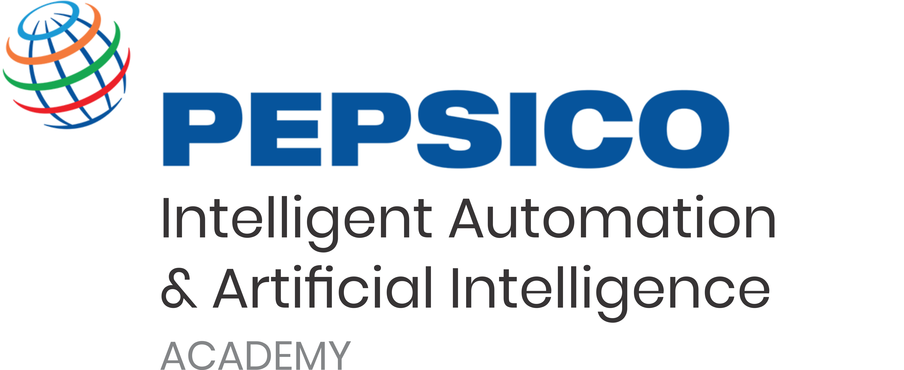

  

  

# RPA con UiPath - Pepsico 2021

## :wave: Bienvenido

El curso de **RPA con UiPath** te brindará las capacidades necesarias para **crear automatizaciones profesionales** haciendo uso de las mejores prácticas para su construcción, no es necesario que tengas conocimientos en programación o en automatización, en este curso arrancamos **desde cero** hasta poder automatizar los escenarios más comunes en la vida cotidiana en **Pepsico**.

## :dart: Objetivo

El objetivo es brindarle una visión general sobre RPA y prepararte para desarrollar robots de software usando UiPath, para que puedas comenzar a **ahorrar tiempo y dinero** en Pepsico y **mejorar tu carrera**.

## :gear: Requerimientos

- Tener una computadora con sistema operativo Windows y conexión a internet.

- Este curso no requiere conocimiento previo específico.

## :bookmark_tabs: Temario
- [`Sesión 01:` Primeros Pasos](Session-01/README.md)

- [`Sesión 02:` Estructuras](Session-02/README.md)

- [`Sesión 03:` Manipulación de la información](Session-03/README.md)

- [`Sesión 04:` Manipulación de Excel](Session-04/README.md)

- [`Sesión 05:` Web Automation](Session-05/README.md)

- [`Sesión 06:` Desktop Application Automation](Session-06/README.md)

- [`Sesión 07:` Automatizaciones Especiales](Session-07/README.md)

- [`Sesión 08:` Buenas prácticas 1](Session-08/README.md)

- [`Sesión 09:` Buenas prácticas 2](Session-09/README.md)

- [`Sesión 10:` Robotic Enterprise Framework](Session-10/README.md)

## :wrench: Proyecto

El proyecto será construir la automatización del proceso que tu escojas:

- Identificar el proceso a automatizar y cada uno de sus pasos.
- Identificar cuáles van a ser las entradas y salidas del proceso a automatizar.
- Identificar los pasos con estructuras condicionales y cíclicas.
- Prepación del proyecto con todo lo necesario.
- Construir el robot que cumpla el objetivo con base a las mejores prácticas de UiPath y Pepsico.

[`Siguiente`](Session-01/README.md)

