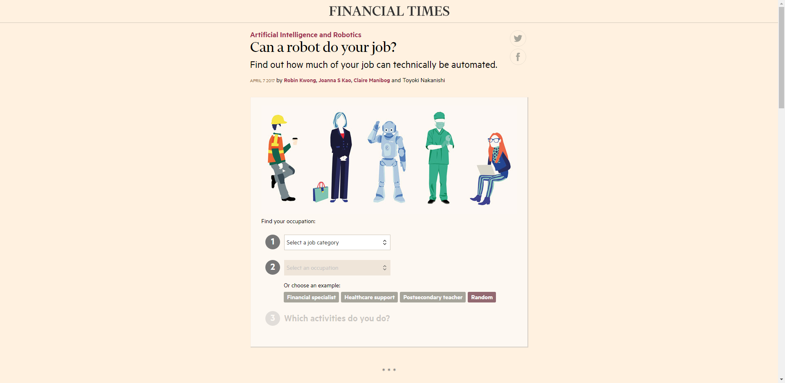
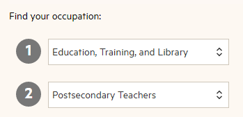
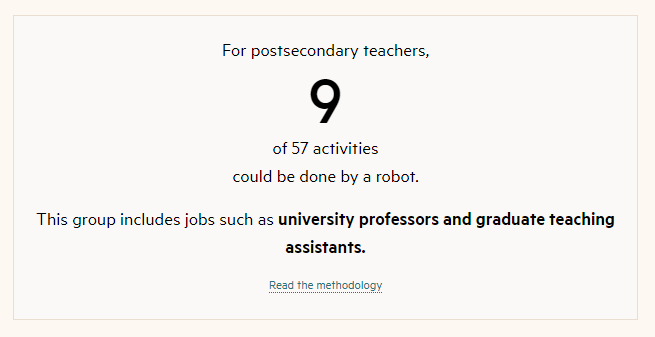
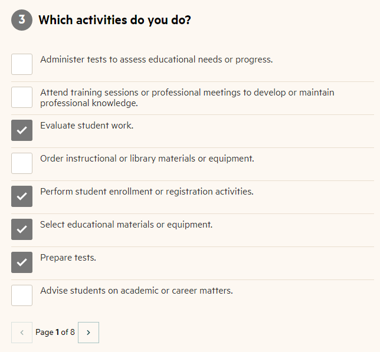

# Reto 01: Can a robot do your job?

## 1. Objetivos :dart:

- Identificar el número de actividades susceptibles a automatizar del rol que desempeñas.
- Identificar cuáles de tus actividades cotidianas son susceptibles a automatizar.

## 2. Desarrollo :hammer:

1. Ingresa al siguiente [portal web](https://ig.ft.com/can-a-robot-do-your-job/). Vas a encontrar una calculadora interactiva que te dará una indicación de como cambiará el futuro del trabajo. 

2. Selecciona la categoría de trabajo y ocupación que más se acorde con tu rol actual.

3. Enterate del número de actividades susceptibles a automatización de tu rol actual.

4. Selecciona las actividades que desempeñas e identifica cuáles son susceptibles a automatización.

 

 <!--

[`Anterior`](../README.md) | [`Siguiente`](../Session-02/README.md)

 -->

