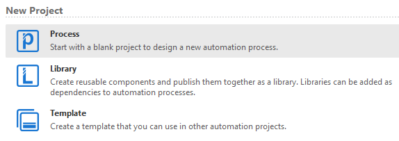

# Ejemplo 01: Crear un proyecto

## 1. Objetivos :dart:

- Conocer los pasos para crear un proyecto
- Crear tu primer proyecto

## 2. Desarrollo :hammer:

1. En la sección de *New Project* selecciona la opción *Process*

2. Llenar el formulario de la siguiente manera:

    - *Name*: "PrimerProyecto"
    - *Location*: **No modificar**
    - *Description*: "Este es mi primer proyecto"

 

 

<!--
[`Anterior`](../README.md) | [`Siguiente`](../Session-02/README.md)
-->

