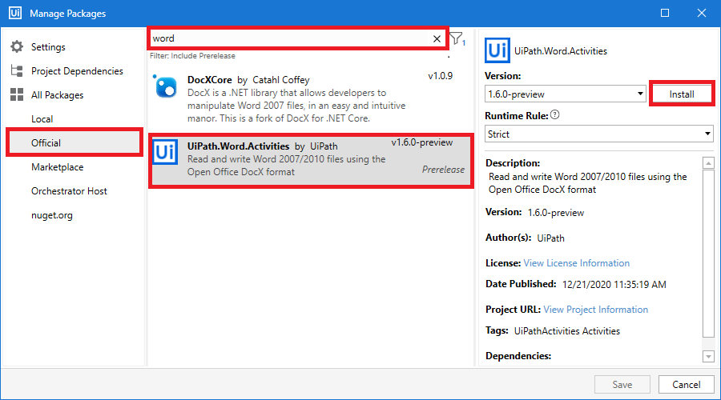
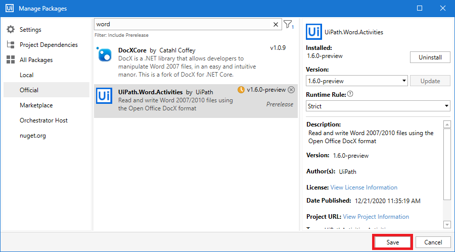
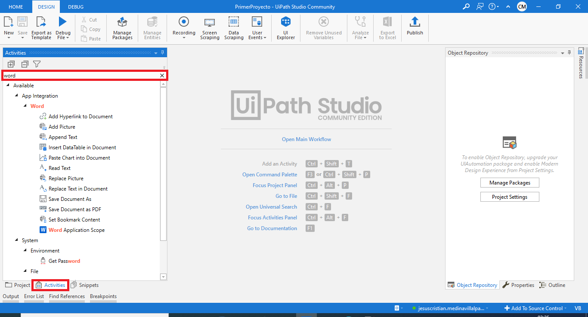
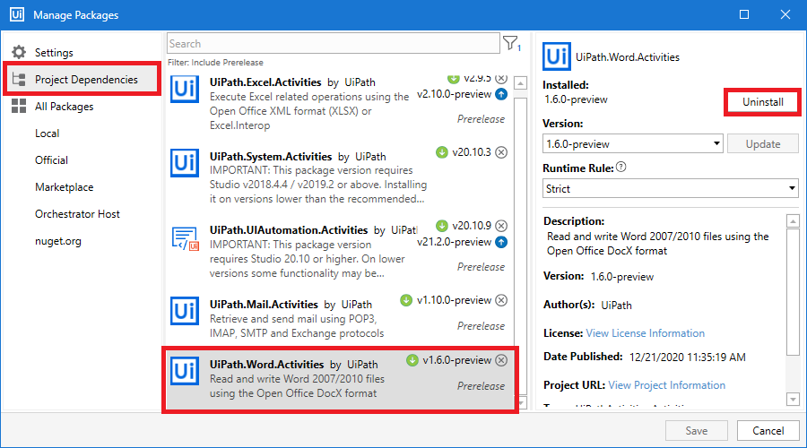
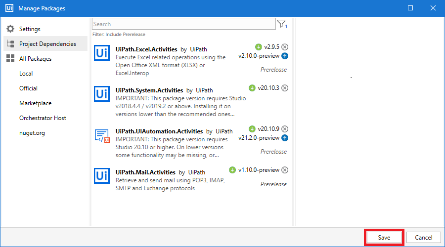
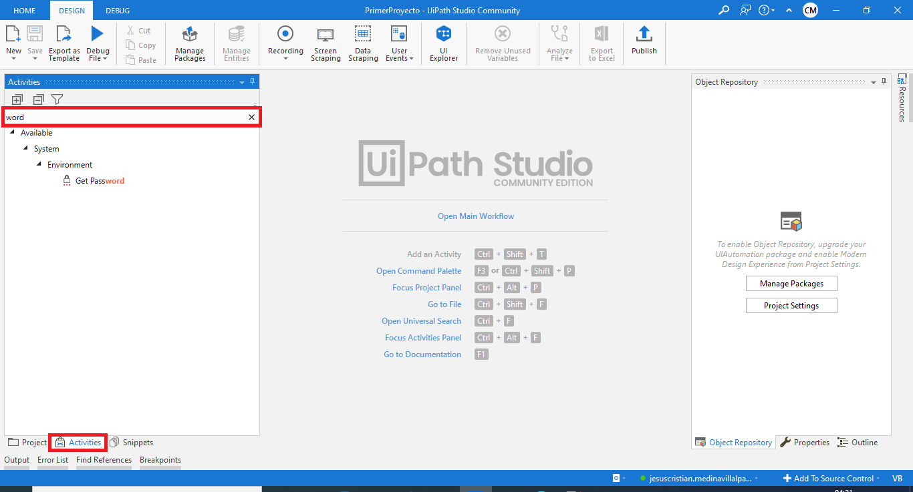

# Ejemplo 02: Instalar y desinstalar un paquete

## 1. Objetivos :dart:

- Conocer los pasos para instalar paquetes.
- Identificar las actividades que incluyen al instalar paquetes.
- Conocer los pasos para desinstalar paquetes.

## 2. Desarrollo :hammer:

1. En la sección de *Manage Packages* seleccionar la opción *Official* para segmentar la búsqueda de los paquetes. Escribir el nombre del paquete a buscar, en este caso: *word*. Seleccionar el paquete **UiPath.Word.Activities**, y dar clic en la opción *Install*.

 

2. Para que los cambios se reflejen, dar clic en la opción *Save*.

 

3. Desplegar el panel de *Activities*, y buscar la actividad **word**. Analiza el contenido de la búsqueda.

 

4. A continuación desplegar nuevamente la ventana de *Manage Packages* y seleccionar la sección *Project Dependencies*, seleccionar el paquete a desinstalar, en este caso: **UiPath.Word.Activies**. Dar clic en *Uninstall*.

 

5. Para que los cambios se reflejen, dar clic en la opción *Save*.

 

6. Desplegar el panel de *Activities*, y buscar la actividad **word**. Analiza el contenido de la búsqueda.

 

[`Anterior`](../Example-01/README.md) | [`Siguiente`](../Postwork/README.md)

