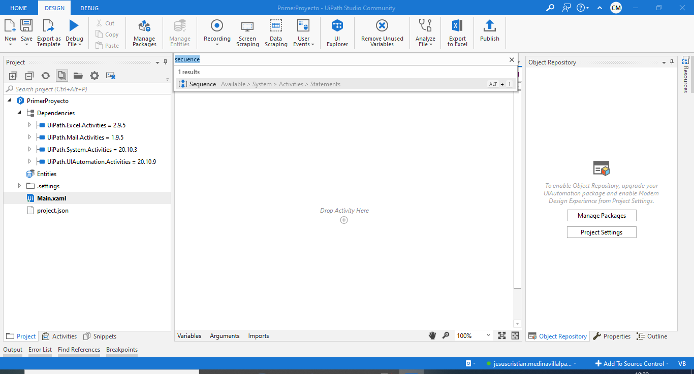

# Ejemplo 01: Mostrar "Hola mundo" en una ventana

## 1. Objetivos :dart:

- Conocer la actividad *Message Box*.
- Conocer el flujo de trabajo *Sequence*.
- Aprender a ejecutar un proyecto.

## 2. Desarrollo :hammer:

1. En el *Project*, dar clic derecho al documento **Main.xaml** y seleccionar la opción ***Open***.

 

2. Dar clic en la opción "+" que aparece al abrir el documento **Main.xaml**.

 

3. En el buscador, escribir la palabra *secuence*, y dar doble clic en el elemento encontrado.

 

4. Se añadirá el flujo de trabajo *Sequence* en nuestro panel de trabajo.

 

5. Ir al panel de *Activities*, y escribir en el buscador la palabra ***message box***.

 

6. Seleccionar la actividad encontrada y **arrastrar** al interior de la caja *Secuence*, tal y como se muestra en la imagen.

 

7. Escribir dentro de la actividad *Message Box*: **"Hola mundo"**. **Nota:** Es importante incluir las comillas.

 

8. Dar clic en la opción de ***Run***, para ejecutar el flujo creado.

 

9. Aparecerá una ventana con el mensaje ingresado.

 

