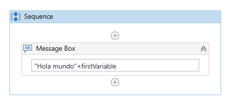

# Ejemplo 02: Mostrar "Hola mundo, ¿cómo estás?" mediante una variable

## 1. Objetivos :dart:

- Conocer los pasos para crear una variable.
- Aprender a utilizar una variable.
- Aprender a concatenar dos contenidos textuales.

## 2. Desarrollo :hammer:

1. Con base en lo realizado en el ejemplo anterior (ejemplo 01), crea una variable con los siguientes valores:

- Name: **firstVariable**
- Type: ***String***
- Scope: ***Sequence***
- Default: **", ¿como estás?"**

 

2. Cambiar el contenido del *Message Box* por: **"Hola mundo"+firstVariable**.

 

3. Dar clic en la opción de ***Run***, para ejecutar el flujo creado.

 

4. Aparecerá una ventana con el mensaje almacenado en la variable.

 

