# Ejemplo 03: Cambiar mi nombre y animal favorito mediante argumentos

## 1. Objetivos :dart:

- Conocer los pasos para crear un nuevo archivo.
- Conocer las actividades de Invoke Workflow File, Multiple Assign.

## 2. Desarrollo :hammer:

1. Dar clic en la opción *New*, posteriormente seleccionar la opción *Sequence*

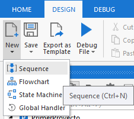

 

2. Llenar el formulario con los siguientes datos y dar clic en el botón ***Create***:

    - Name: **ProbarArgumentos**
    - Location: **No modificar**

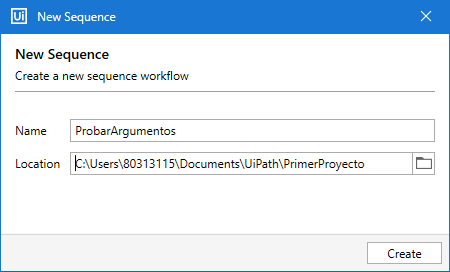

 

3. Crear los siguientes argumentos con las siguientes características:

    - Argumento 1:
        - Name: **inout_str_name**
        - Direction: **In/Out**
        - Argument Type: **String**
        - Default value: N/A

    - Argumento 2:
        - Name: **inout_str_favoriteAnimal**
        - Direction: **In/Out**
        - Argument Type: **String**
        - Default value: N/A

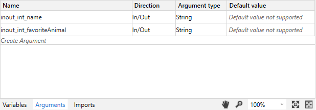

 

4. En el panel de *Project* dar clic derecho al archivo Main.xaml y seleccionar la opción *Open*

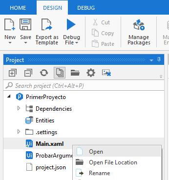

 

5. En el panel de *Activities* buscar la actividad *Invoke Workflow File*. Seleccionar y arrastrarla después del Message Box, tal y como se muestra en la imagen.

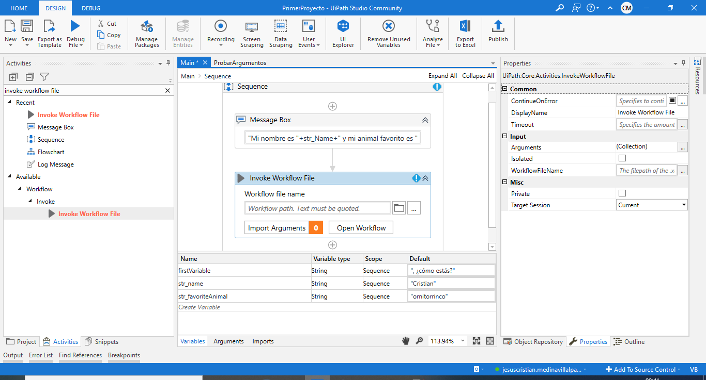

 

6. Seleccionar la opción ***Browse for file*** (ícono de carpeta) de la actividad *Invoke Workflow File*.

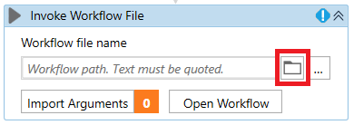

 

7. Seleccionar el archivo ***ProbarArgumentos.xaml*** y dar clic en el botón ***Open***.

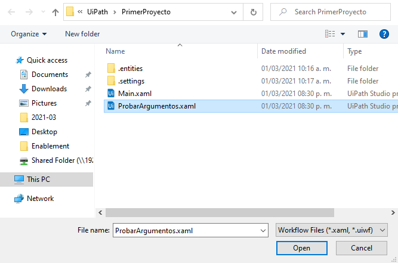

 

8. Dar clic en el botón *Import Arguments*.

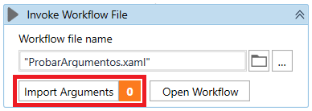

 

9. Asignar los valores de la siguiente forma y dar clic en el botón OK:
    - Al argumento **inout_str_name** asignar el valor de la variable **str_name**.
    - Al argumento **inout_str_favoriteAnimal** asignar el valor de la variable **str_favoriteAnimal**.

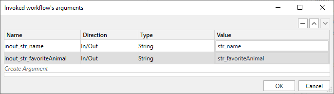

 

10. En el panel de *Project* dar clic derecho al archivo ProbarArgumentos.xaml y seleccionar la opción *Open*.

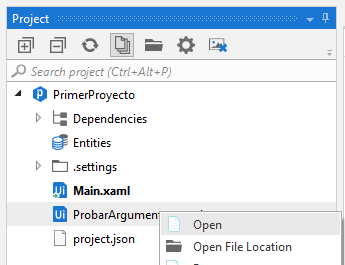

 

11. Añadir la actividad *Message Box* con el siguiente mensaje: "Mi nombre todavía es "+inout_str_name+" y mi animal favorito todavía es+inout_str_favoriteAnimal".

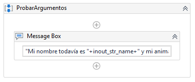

12. En el panel de *Activities*, buscar la actividad ***Multiple Assign*** y añadirla tal como se muestra en la imagen.

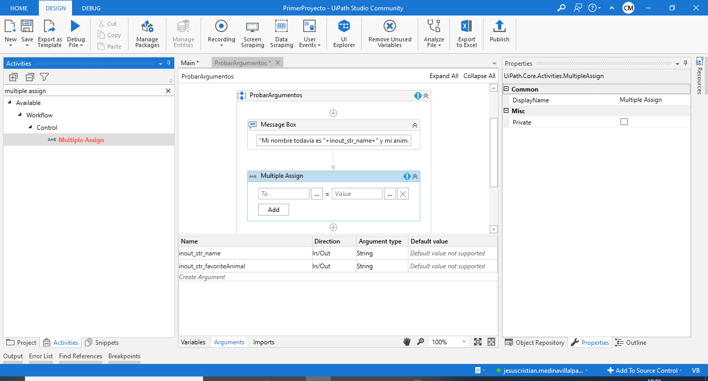

 

13. Del lado izquierdo escribir el argumento al que quieres modificar su contenido y del lado lado derecho el nuevo valor. En este caso, modificar los siguientes 2 argumentos. **NOTA:** Para poder modificar más de una variable seleccionar la opción ***Add***.

- Nombre de argumento/variable = Nuevo valor
    - inout_str_name = "&lt;nuevo nombre>"
    - inout_str_favoriteAnimal = "&lt;nuevo animal favorito>"

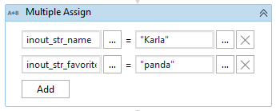

 

14. En el panel de *Project* dar clic derecho al archivo Main.xaml y seleccionar la opción *Open*.

 

15. Añadir la actividad *Message Box* con el siguiente mensaje: "Mi nuevo nombre es "+str_name+" y mi nuevo animal favorito es+str_favoriteAnimal".

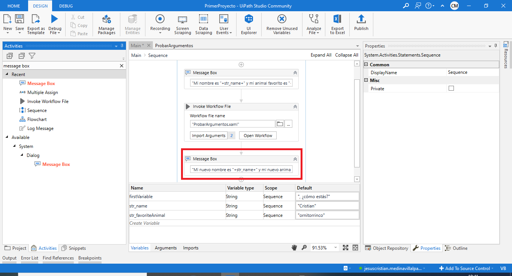

 

16. Dar clic en la opción de ***Run***, para ejecutar el flujo creado. **NOTA:** Debes tener abierto el archivo Main.xaml antes de ejecutar el flujo.

 

17. Apareceran las siguiente ventanas de modo secuencial.

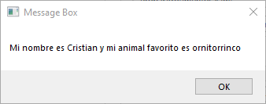

 

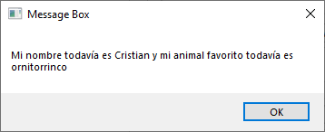

 

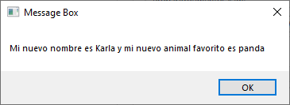

 

[`Anterior`](../Challenge-01/README.md) | [`Siguiente`](../Example-02/README.md)

