# Ejemplo 04: Acciones para el tipo de variable String

## 1. Objetivos :dart:

- Conocer 

## 2. Desarrollo :hammer:

1. Crea un nuevo archivo con el nombre "MétodosTipoVariableString" (utiliza *Sequence*).

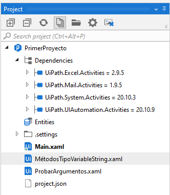

 

2. Crea una variable con las siguientes características:
    - Name: **str_texto**
    - Variable Type: **String**
    - Scope: **MétodosTipoVariableString**
    - Default: **"Trabajo de lunes a jueves"**

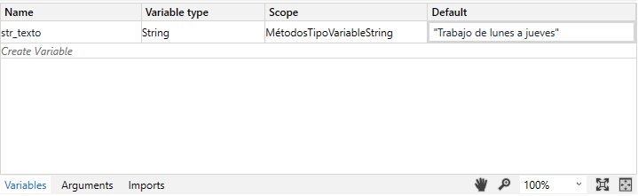

 

3. Insertar un *Message box* y que tenga el siguiente contenido: str_texto.Length

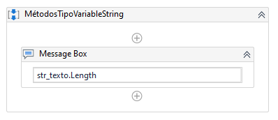

 

4. Insertar un *Message box* y que tenga el siguiente contenido: str_texto.Replace("jueves","viernes")

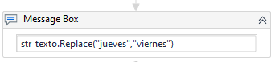

 

5. Insertar un *Message box* y que tenga el siguiente contenido: str_texto.Concat(str_texto," en Pepsico")

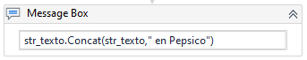

 

6. Insertar un *Message box* y que tenga el siguiente contenido: str_texto.Contains("lunes")

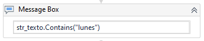

 

7. Insertar un *Message box* y que tenga el siguiente contenido: str_texto.Substring(0,7)

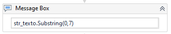

 

8. Dar clic en la opción de ***Run***, para ejecutar el flujo creado. **NOTA:** Debes tener abierto el archivo **MétodosTipoVariableString.xaml** antes de ejecutar el flujo.

 

9. Apareceran las siguiente ventanas de modo secuencial.

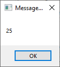

 

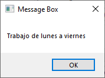

 

 

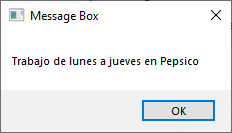

 

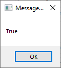

 

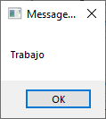

 

[`Anterior`](../Challenge-01/README.md) | [`Siguiente`](../Example-02/README.md)

