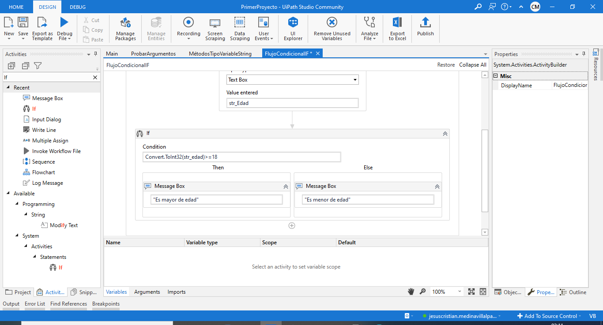
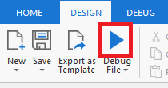
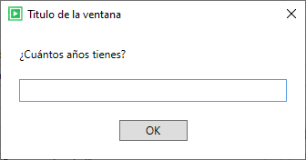

# Ejemplo 05: Evaluador de mayoría de edad

## 1. Objetivos :dart:

- Conocer la importancia de la declaración condificional *IF*.
- Conocer la actividad *Input Dialog* (*Text Box*).

## 2. Desarrollo :hammer:

1. Crea un nuevo archivo con el nombre "FlujoCondicionalIF" (utiliza el flujo de trabajo *Sequence*).

 

2. Crea una variables con las siguientes características:
    - Name: **str_Edad**
    - VariableType: **String**
    - Scope: **FlujoCondicionalIF**
    - Default: N/A

 

3. En el panel de *Activities* busca la actividad *Input Dialog*, añadela al flujo y escribe los siguientes valores:
    - Dialog Title: **"Titulo de la ventana"**
    - Input Label: **"¿Cuántos años tienes?"**
    - Input Type: **Text Box**
    - Value entered: **str_edad**

 

4. En el panel de *Activities* busca la actividad *If*, añadela al flujo y escribe los siguientes valores:
    - Condition: **Convert.ToInt32(str_edad)>=18**

 

5. Añade una actividad de *Message Box* en ambos flujos del *If* y según el camino escribe el siguiente mensaje:

    - Para el flujo donle la condición es afirmativa (*Then*): "Es mayor de edad"
    - Para el flujo donle la condición es negativa (*Then*): "Es menor de edad"

 

6. Dar clic en la opción de ***Run***, para ejecutar el flujo creado. **NOTA:** Debes tener abierto el archivo **FlujoCondicionalIF.xaml** antes de ejecutar el flujo.

 

7. Aparecerá una ventana como la siguiente. Ingresa tu edad y da clic en el botón *OK*.

 

8. Dependiendo del valor ingresado, podrán aparecer uno de los siguientes mensajes.

 

 

