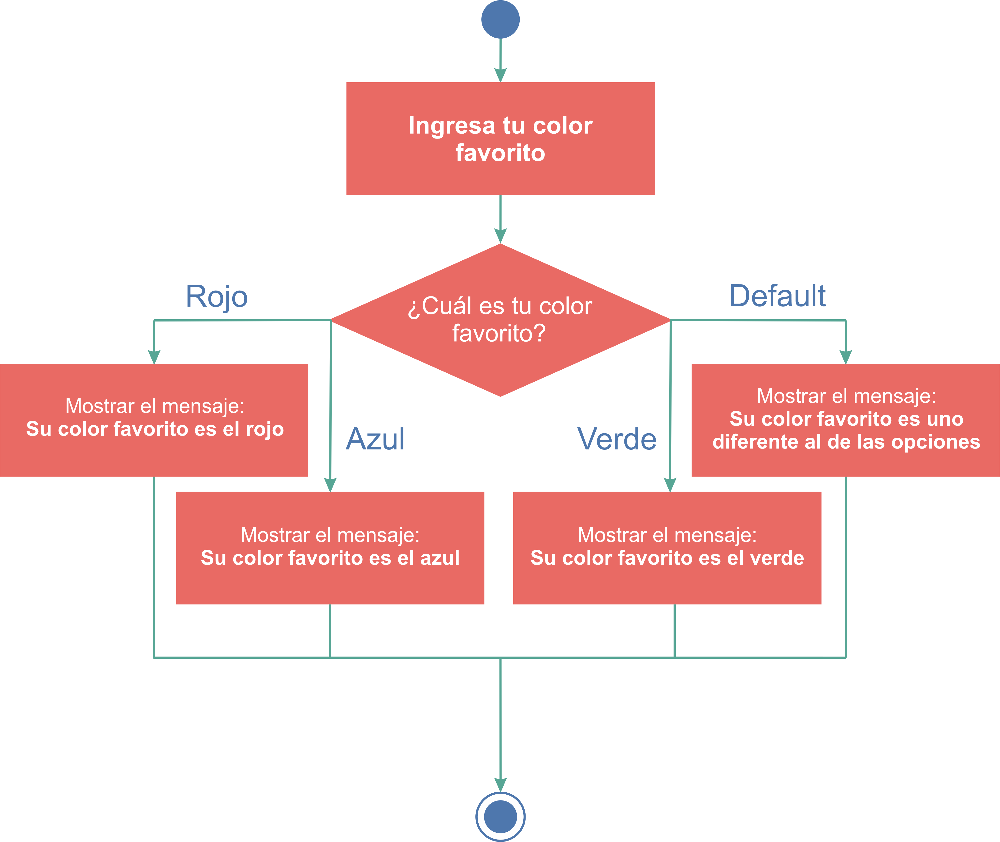
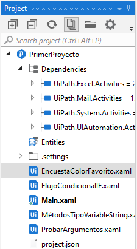
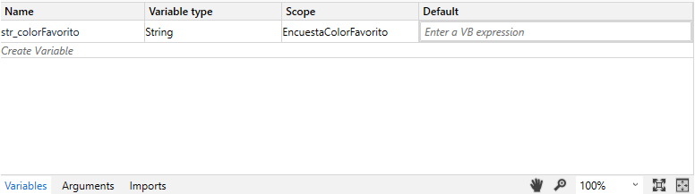
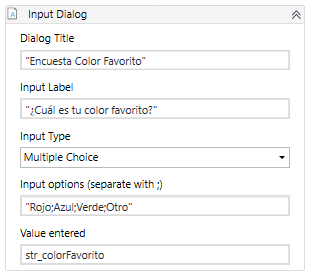
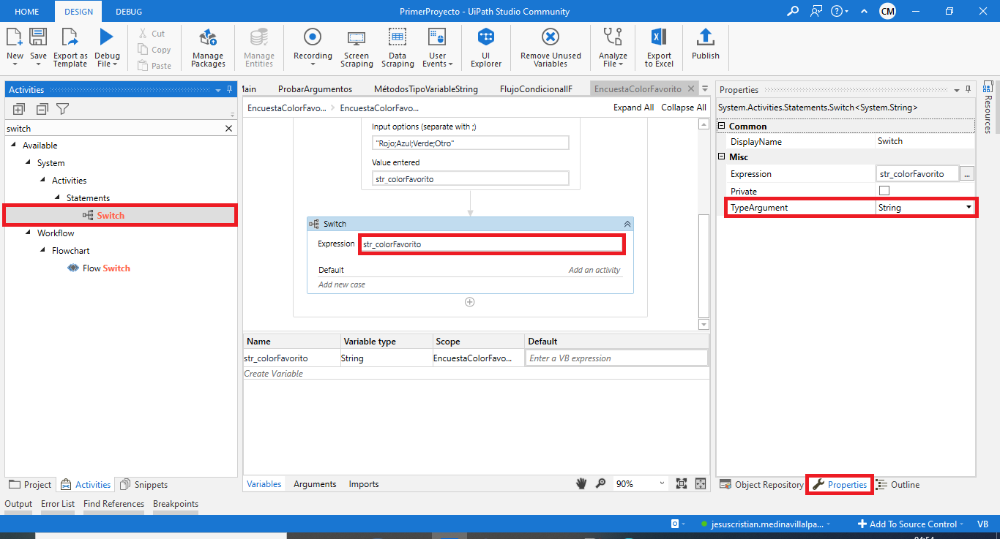
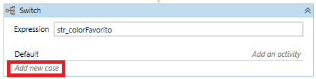
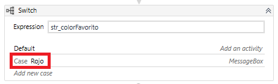
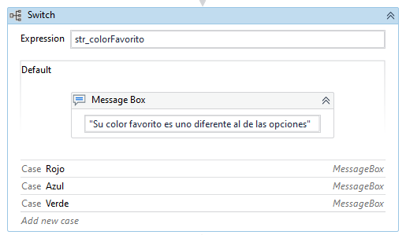
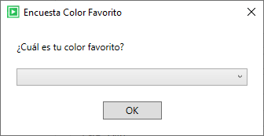
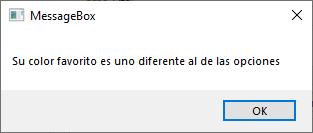

# Ejemplo 06: Encuesta para tu saber tu color favorito

## 1. Objetivos :dart:

- Conocer la importancia de la declaración condicional *Switch*.
- Conocer la actividad *Input Dialog* (*Multiple Choice*).
- Construir el siguiente flujo:

 

## 2. Desarrollo :hammer:

1. Crea un nuevo archivo con el nombre "EncuestaColorFavorito" (utiliza el flujo de trabajo *Sequence*).

 

2. Crea una variable con las siguientes características:
    - Name: **str_colorFavorito**
    - Variable Type: **String**
    - Scope: **EncuestaColorFavorito**
    - Default: N/A

 

3. En el panel de *Activities* busca la actividad *Input Dialog*, añadela al flujo e ingresa los siguientes valores:
    - Dialog Title: **"Encuesta Color Favorito"**
    - Input Label: **"¿Cuál es tu color favorito?"**
    - Input Type: **Multiple Choice**
    - Input options: **"Rojo;Azul;Verde;Otro"**
    - Value entered: **str_colorFavorito**

 

4. En el panel de *Activities* busca la actividad *Switch*, añadela al flujo, escribe como *expression*: ***str_colorFavorito***. Teniendo seleccionado la actividad *Switch* y dirigete al panel de *Properties* y verifica que la propiedad *TypeArgument* tenga la opción ***String***. 

 

5. Dar clic en la opción ***Add new case***.

 

6. En la opción ***Case value*** desplegada, escribir: **"Rojo"**n  

 

7. Realizar lo mismo para cada una de las opciones anteriores: Azul y Verde. La sesión *Default* será la sección para cualquiera otra opción que no sea Rojo, Azul o Verde.

8. En cada uno de los casos agregar un *Message Box*, con el mensaje según corresponda:
    - Rojo:  "Su color favorito es el rojo"
    - Azul: "Su color favorito es el azul"
    - Verde: "Su color favorito es el verde"
    - Otro: "Su color favorito es uno diferente al de las opciones"

 

9. Dar clic en la opción de ***Run***, para ejecutar el flujo creado. **NOTA:** Debes tener abierto el archivo **EncuestaColorFavorito.xaml** antes de ejecutar el flujo.

 

10. Seleccionar una de los opciones y dar clic en ***"OK"***.

 

11. Aparecerá un mensaje según la opción escogida.

 

