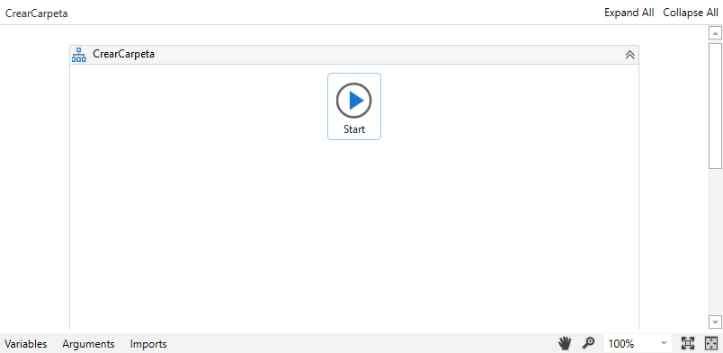
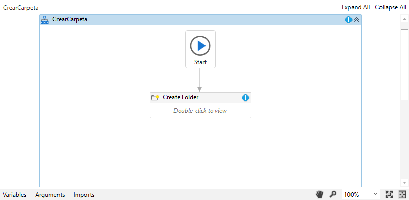
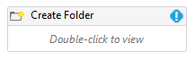
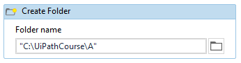
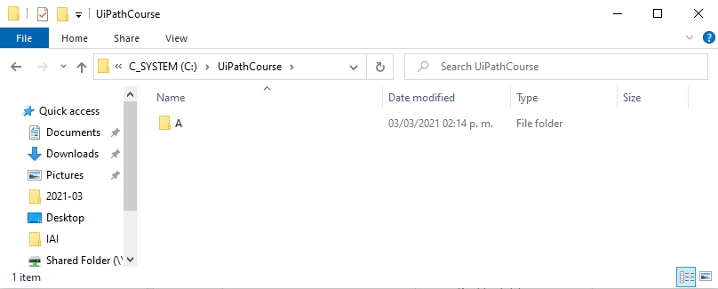

# Ejemplo 01: Crear una carpeta

## 1. Objetivos :dart:

- Aprender a crear una carpeta.
- Conocer el flujo de trabajo *Flowchart*.
- Aprender a utilizar la actividad *Create Folder*.

## 2. Desarrollo :hammer:

1. Crear el archivo **CrearCarpeta** (utiliza el flujo de trabajo ***Flowchart***). Dentro del panel de trabajo debe aparecer lo siguiente:

 

2. Añadir la actividad ***Create Folder*** y unirlo al nodo ***Start***.

 

3. Dar doble clic a la actividad insertada.

 

4. Escribir la siguiente ruta: **"C:\UiPathCourse\A"**

 

5. Ejecutar y observar la carpeta creada en la ruta especificada.

 

