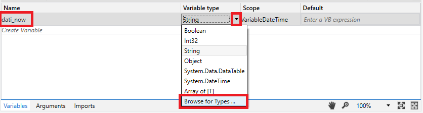
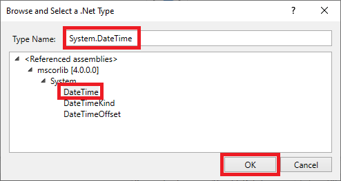
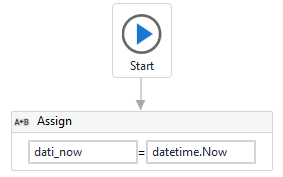
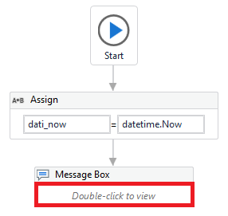
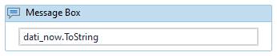

# Ejemplo 02: Variable DateTime

## 1. Objetivos :dart:

- Aprender a utilizar la variable *DateTime*.
- Conocer la  actividad *Assign*.

## 2. Desarrollo :hammer:

1. Crear el archivo **VariableDateTime** (utiliza el flujo de trabajo *Flowchart*). 

2. En el panel de *Variables*, crear una variable con el nombre: **`"dati_now"`**

3. Desplegar las opciones del *Variable Type* y selccionar la opción *Browse for Types*

 

4. En la sección *Type Name* escribir: **`"System.DateTime"`**

    Seleccionar la opción **DateTime** de la lista desplegable y dar clic en ***OK**.

 

5. Agregar la actividad *Assign* e ingresar los siguientes valores:

    - Del lado izquierdo: **`"dati_now"`**
    - Del lado derecho: **`"datetime.Now"`**

 

6. Agregar la actividad *Message Box* y dale doble clic.

 

7. Escribir dentro de la actividad *Message Box*: **`"dati_now.ToString"`**

 

8. Ejecuta el proceso y analiza los resultados.

 

