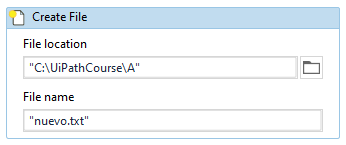
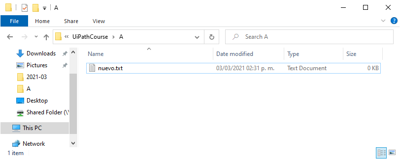

# Ejemplo 02: Crear un archivo

## 1. Objetivos :dart:

- Aprender a utilizar la actividad *Create File*.

## 2. Desarrollo :hammer:

1. Crear el archivo **CrearArchivo** (utiliza el flujo de trabajo *Flowchart*). Añadir la actividad **Create File** e ingresar los siguientes valores:

    - File location: ***"C:\UiPathCourses\A"***
    - File name: ***"nuevo.txt"***

 

2. Ejecutar y observar el archivo creado en la ruta especificada.

 

