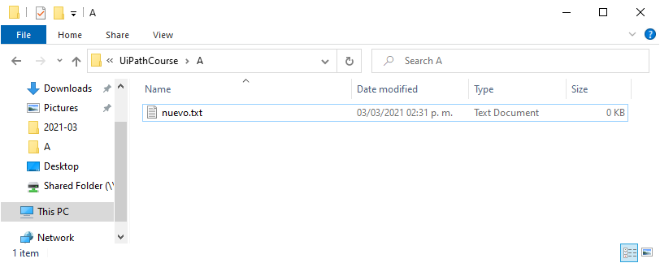

# Ejemplo 03: Crear un archivo no existente

## 1. Objetivos :dart:

- Conocer los pasos para la verificación de la existencia de un archivo específico.
- Entender la diferencia entre el flujo de trabajo *Sequence* y *Flowchart*.
- Aprender a utilizar la actividad *Flow Decision*.
- Aprender a utilizar el comando *File.Exists()*.

## 2. Desarrollo :hammer:

1. Crear el archivo **CrearArchivoNoExistente** (utiliza el flujo de trabajo *Flowchart*). Añadir la actividad *Flow Decision* y conectarla al nodo *Start*.

 

2. Selecciona la actividad que acabas de agregar, dirigete al panel de *Properties* y da clic en los "..." de la propiedad *Condition*.

 

3. Escribir la siguiente condición: **File.Exists("C:\UiPathCourse\A\nuevo.txt")**. Y dar clic en *OK*.

 

4. Añadir dos *Message Box*, y unir a la actividad *Flow Decision*, tal y como se muestra en la imagen.

 

4. Según el camino del *Message Box*, vas a escribir lo siguiente:
    - Para el camino del *True*: "Existe"
    - Para el camino del *False*: "No existe"

5. Ejecuta el proceso y dependiendo de la existencia del archivo recibirás el mensaje correspondiente.

