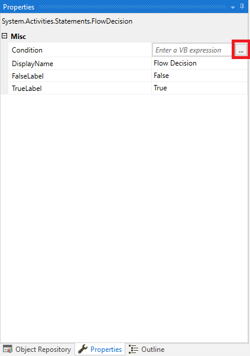
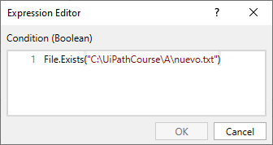
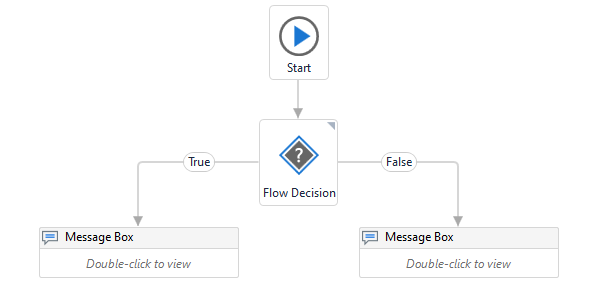

# Ejemplo 04: Copiar, mover y eliminar un archivo

## 1. Objetivos :dart:

- Aprender a cómo copiar, mover y eliminar un archivo
- Aprender a utilizar la actividad *Copy File*, *Move File* y *Delete*.
- Entender la propiedad *Overwrite*.

## 2. Desarrollo :hammer:

1. Crear manualmente las carpetas con nombre **"B"** y **"C"** en el directorio "C:\UiPathCourse\\".

 

2. Dentro de la carpeta "A", solo deberá existir el archivo "test.txt".

 

3. Crear el archivo ***CopiarMoverEliminarArchivo.xaml*** (con el flujo de trabajo *Flowchart*) y añadir la actividad **Copy File**.

 

4. Dentro de la actividad *Copy File* ingresar los siguientes valores:

- From: **"C:\UiPathCourse\A\test.txt"**
- To: **"C:\UiPathCourse\B\test.txt"**

    **NOTA:** Seleccionar la opción *Overwrite*.

 

5. Añadir la actividad **Move File**, tal y como se muestra en la imagen:

 

6. Dentro de la actividad *Move File* ingresar los siguientes valores:

- From: **"C:\UiPathCourse\B\test.txt"**
- To: **"C:\UiPathCourse\C\test.txt"**

    **NOTA:** Seleccionar la opción *Overwrite*.

 

7. Añadir la actividad **Delete**, tal y como se muestra en la imagen:

 

8. Seleccionar la actividad *Delete*, ir al panel de *Properties* y seleccionar el botón "..." de la propiedad *Path*. Escribir lo siguiente: **C:\UiPathCourse\C\test.txt** y dar clic en el botón *OK*.

 

9. Ejecutar el flujo y revisar los resultados.

