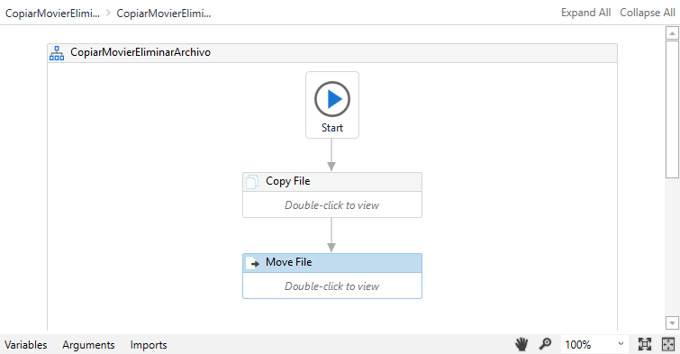

# Ejemplo 05: Copiar y mover un archivo

## 1. Objetivos :dart:

- Aprender a cómo copiar y mover un archivo
- Aprender a utilizar las actividades *Copy File* y *Move File*.
- Entender la propiedad *Overwrite*.

## 2. Desarrollo :hammer:

1. Crear manualmente las carpetas con nombre **"B"** y **"C"** en el directorio "C:\UiPathCourse\\".

 

2. Dentro de la carpeta "A", solo deberá existir el archivo "test.txt".

 

3. Crear el archivo ***CopiarMoverArchivo.xaml*** (con el flujo de trabajo *Flowchart*) y añadir la actividad **Copy File**.

 

4. Dentro de la actividad *Copy File* ingresar los siguientes valores:

- From: **`"C:\UiPathCourse\A\test.txt"`**
- To: **`"C:\UiPathCourse\B\test.txt"`**

    **NOTA:** Seleccionar la opción *Overwrite*.

 

5. Añadir la actividad **Move File**, tal y como se muestra en la imagen:

 

6. Dentro de la actividad *Move File* ingresar los siguientes valores:

- From: **`"C:\UiPathCourse\B\test.txt"`**
- To: **`"C:\UiPathCourse\C\test.txt"`**

    **NOTA:** Seleccionar la opción *Overwrite*.

 

7. Ejecutar el flujo y revisar los resultados.

 

