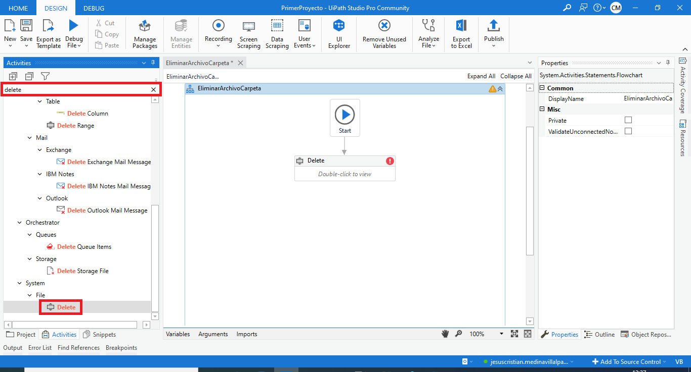
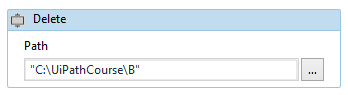
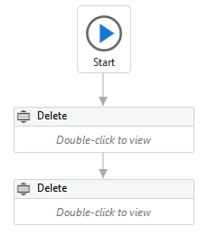
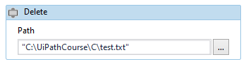

# Ejemplo 06: Eliminar un archivo y una carpeta

## 1. Objetivos :dart:

- Aprender a cómo eliminar un archivo y una carpeta
- Aprender a utilizar la actividad *Delete*.

## 2. Desarrollo :hammer:

1. Verificar que en el directorio "C:\UiPathCourse\\" tengas dos carpetas: **B** y **C**. Que la carpeta B este vacía y la carpeta C tengo solamente el archivo "test.txt".

2. Crear el archivo ***EliminarArchivoCarpeta.xaml*** (con el flujo de trabajo *Flowchart*) 

3. Buscar y añadir la actividad **Delete**, tal y como se muestra en la imagen:

 

4. Dar doble clic a la actividad *Delete* y escribir lo siguiente: **`"C:\UiPathCourse\B"`**

 

5. Añadir una segunda actividad *Delete*.

 

6. Dar doble clic a la segunda actividad *Delete* y escribir lo siguiente: **`"C:\UiPathCourse\C\test.txt"`**

 

7. Ejecutar el flujo y revisar los resultados.

 

