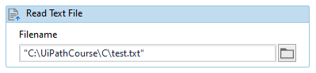
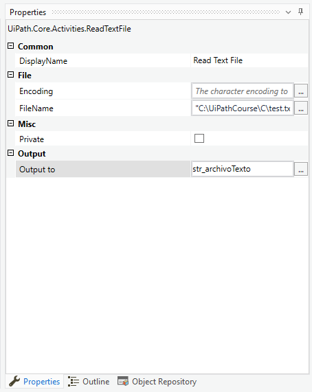

# Ejemplo 07: Leer un archivo de texto

## 1. Objetivos :dart:

- Aprender a cómo leer un archivo de texto.
- Conocer la actividad *Read Text File*.

## 2. Desarrollo :hammer:

1. Verificar que en el directorio "C:\UiPathCourse\\" tengas la carpeta: **C**. La carpeta C debe tener un archivo "test.txt". El archivo de texto debe tener contenido, por ejemplo: **`Este es el contenido del archivo de texto`**

2. Buscar y agregar la actividad *Read Text File*.

3. Dentro de la actividad *Read Text File* escribir: **`C:\UiPathCourse\C\test.txt`**

 

4. En la propiedades de la actividad *Read Text File*, localizar la sección *Output to* y escribe el nombre de la variable **`str_archivoTexto`**.

    **TIP:** Crea la variable al mismo momento que la utilizas mediante **Ctrl+K**.

 

5. Añadir un *Message Box* y mostrar el contenido de la variable: **`str_archivoTexto`**

6. Ejecutar el flujo y revisar los resultados.

 

