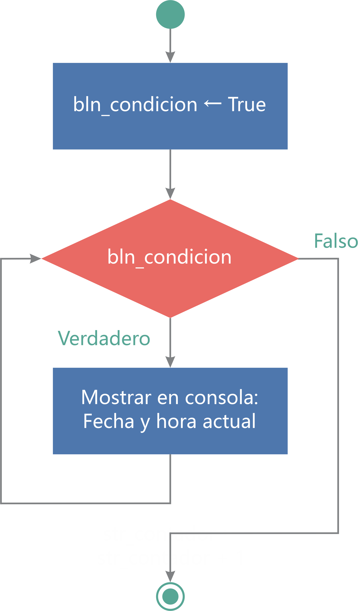

# Ejemplo 01: Ciclo infinito

## 1. Objetivos :dart:

- Entender el funcionamiento de la estructura *While*.
- Construir el siguiente flujo:

 

## 2. Desarrollo :hammer:

1. Crear el archivo ***CicloInfinito.xaml*** (con el flujo de trabajo *Flowchart*).

2. Crear una variable con las siguientes características:

    - Name: **`bln_respuesta`**
    - Variable type: **`Boolean`**

 

3. Añadir la actividad ***Assign***, hacer la conexión como se muestra en la imagen y escribir los siguientes datos:

    - Del lado izquierdo: **`bln_condicion`**
    - Del lado derecho: **`True`**

 

4. Añadir la actividad ***While*** y hacer la conexión como se muestra en la imagen:

 

5. Dar doble clic en la actividad *While* y escribir dentro de la sección *Condition*: *`bln_condition`*

 

6. Añadir la actividad ***Write Line*** dentro del ***Body*** de la actividad *While*, tal como se muestra en la imagen y escribir en su interior: *`DateTime.Now.ToString`*

 

7. Ejecutar el flujo y ver los resultados.

