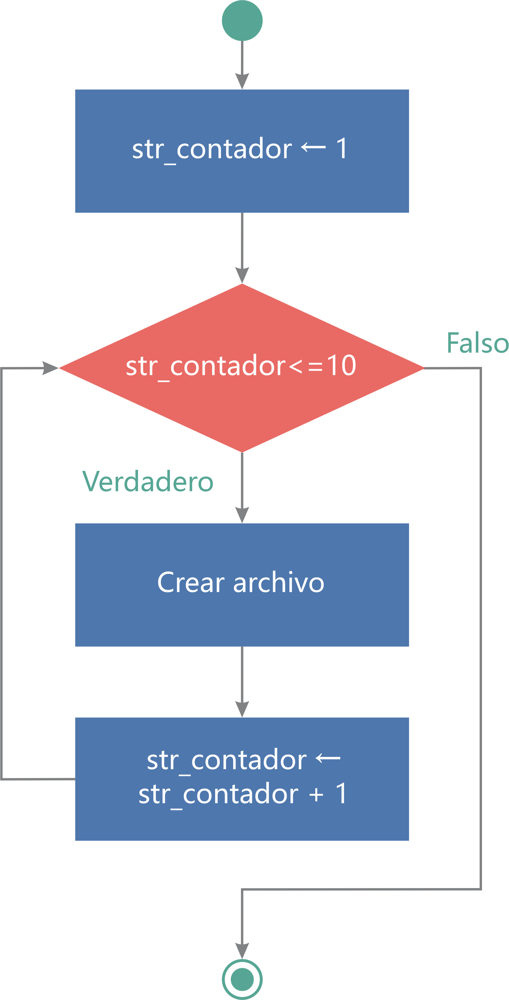
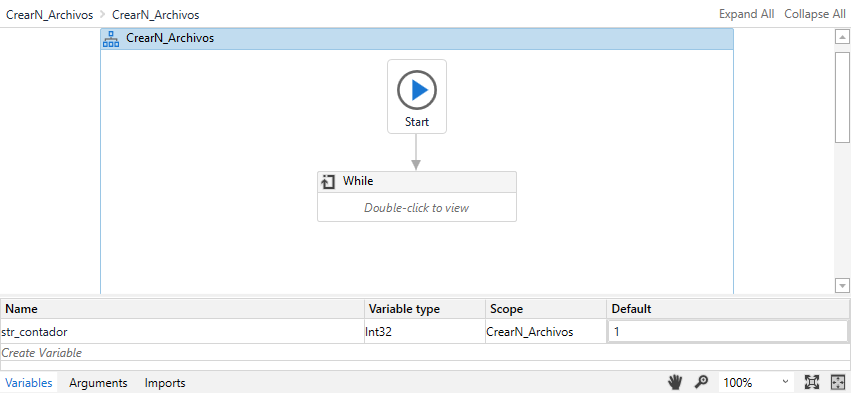
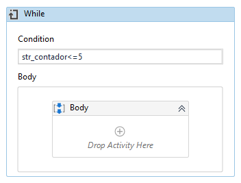
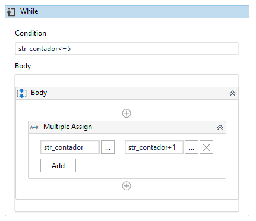
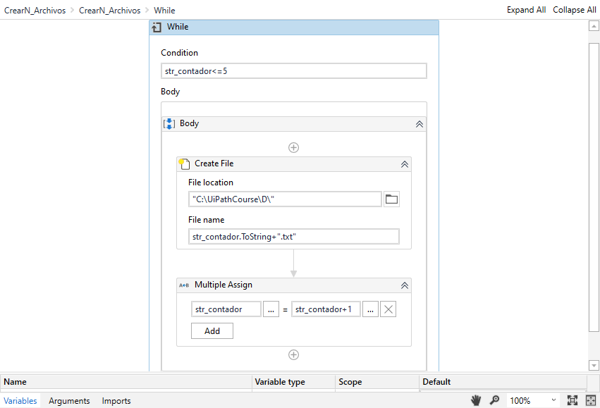

# Ejemplo 02: Crear 10 archivos

## 1. Objetivos :dart:

- Aprender a cómo crear de manera dinámica archivos de texto.
- Entender el funcionamiento de la estructura *While*.
- Construir el siguiente flujo:

 

## 2. Desarrollo :hammer:

1. Crear manualmente la carpeta **"D"**.

2. Crear el archivo ***Crear10Archivos.xaml*** (con el flujo de trabajo *Flowchart*).

3. Crear una variable con las siguientes características:

    - Name: **`str_contador`**
    - Variable type: **`Int32`**
    - Default: **`1`**

4. Añadir la actividad ***While***, tal y como se muestra en la imagen:

 

5. Escribir la siguiente condición: **`str_contador<=5`**

 

6. Dentro del *Body* de la actividad *While* añadir la actividad *Multiple Assign* y escribir los siguientes valores:

    - Del lado izquierdo: **`str_contador`**
    - Del lado derecho: **`str_contador+1`**

 

7. Añadir la actividad *Create file* como se muestra en la imagen y añadir los siguientes valores:

    - File location: **`"C:\UiPathCourse\D\"`**
    - File name: **`str_contador.ToString+".txt"`**

 

8. Ejecutar el flujo y ver los resultados.

