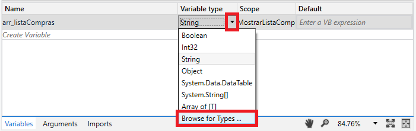
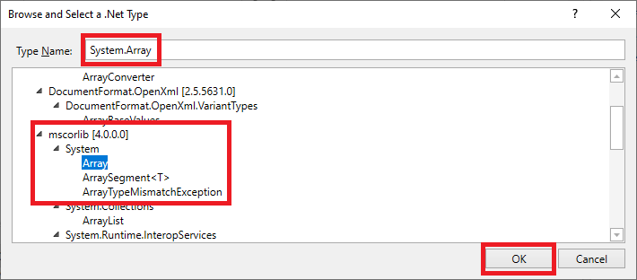
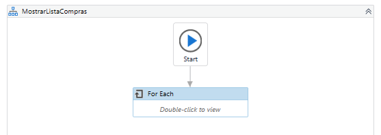
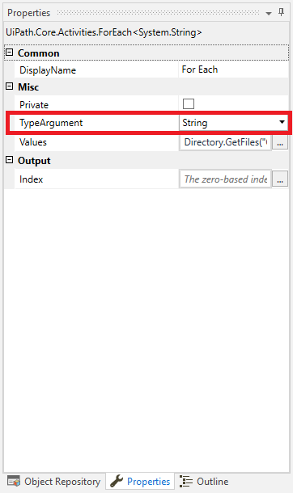
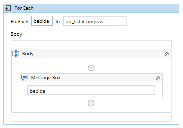

# Ejemplo 03: Mostrar cada de una lista de compras

## 1. Objetivos :dart:

- Entender el funcionamiento de la estructura *For Each*.
- Conocer la variable *Array*.

## 2. Desarrollo :hammer:

1. Crear el archivo ***MostrarListaCompras*** (con el flujo de trabajo *Flowchart*).

2. Crear la variable ***`arr_listaCompras`***, desplegar la lista de opciones de la sección *Variable Type* y escoger la opción *Browse for types*.

 

3. Escribir en la sección *Type Name*: ***`System. Array`***
    
    Seleccionar la opción que aparece en la ruta **mscorlib / System**. Y dar clic en *OK*.

 

4. Añadir la actividad ***For Each***, tal como se muestra a continuación:

 

5. Seleccionar la actividad *For Each*, ir al panel de *Properties* y verificar que la propiedad ***TypeArgument*** tenga la opción ***String***.

 

6. Escribir los siguientes valores:
    - *ForEach* ***`bebida`*** *In* ***`arr_listaCompras`***

    Dentro del *Body*, añadir la actividad *MessageBox* y escribir: ***`bebida`***

 

7. Ejecutar el flujo y ver los resultados.

