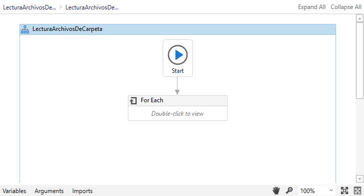
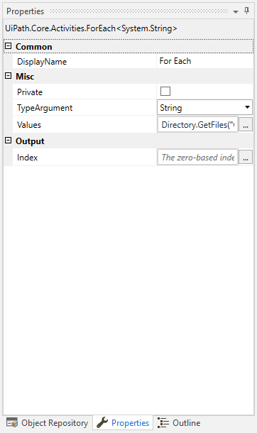
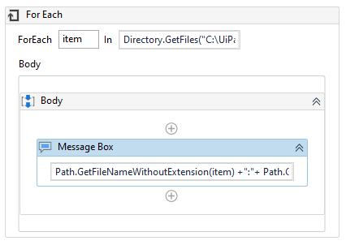

# Ejemplo 06: Obtención del nombre de archivos en un directorio

## 1. Objetivos :dart:

- Aprender a recorrer los archivos de una carpeta.
- Entender el funcionamiento de la estructura *For Each*.
- Aprender el funcionamiento de los comandos *Path.GetFileNameWithoutExtension()* y *Path.GetExtension()*

## 2. Desarrollo :hammer:

1. Utilizaremos la carpeta **"D"** con los cinco archivos de texto ya creados.

2. Crear el archivo ***LecturaArchivosDeCarpeta.xaml*** (con el flujo de trabajo *Flowchart*).

3. Añadir la actividad ***For Each***, tal como se muestra a continuación:

 

4. Seleccionar la actividad, ir al panel de *Properties* y verificar que la propiedad ***TypeArgument*** tenga la opción ***String***.

 

5. Escribir los siguientes valores:
    - *ForEach* ***item*** *In* **Directory.GetFiles("C:\UiPathCourse\D\")**

    Dentro del *Body*, añadir la actividad *MessageBox* y escribir el siguiente texto: ***Path.GetFileNameWithoutExtension(item) +":"+ Path.GetExtension(item)***

 

6. Ejecutar el flujo y ver los resultados.

