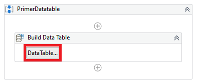
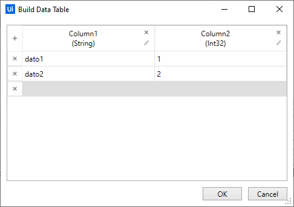
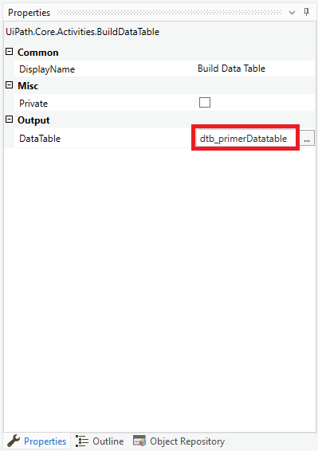
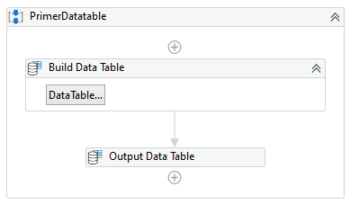
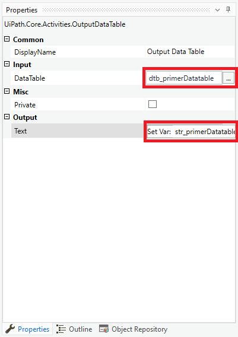
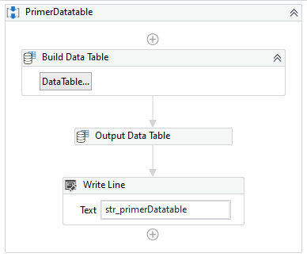

# Ejemplo 01: Crear un datatable con contenido y mostrar en consola

## 1. Objetivos :dart:

- Entender...

## 2. Desarrollo :hammer:

1. Crear el archivo ***PrimerDatatable.xaml*** (con el flujo de trabajo *Sequence*).

2. Crear una variable con las siguientes características:

    - Name: **`dtb_primerDatatable`**
    - Variable type: **`Datatable`**

    **Tip:** Si no te aparece el tipo de variable *DateTable*, dentro del buscador escribe *System.Data.DataTable*

3. Añadir la actividad *Build Data Table* y dar clic en el botón *DataTable...*.

 

4. Llenar la cuadrícula como se muestra en la imagen y dar clic en *OK*.

 

5. Ir a las propiedades de la actividad *Build Data Table* y en la propiedad *Output / DataTable* escribir **`dtb_primerDatatable`**

 

6. Añadir la actividad *Output Date Table*.

 

7. Ir a las propiedades de la actividad *Output Data Table* y escribir los siguientes valores:

    - Input / Datatable: **`dtb_primerDatable`**
    - Output / Text: **`str_primerDatatable`** ( **TIP:** Utilizar *Ctrl + K* )

 

8. Añadir la actividad *Write Line* y dentro de su campo de texto escribir **`str_primerDatatable`**

 

9. Ejecutar el flujo y ver los resultados.

