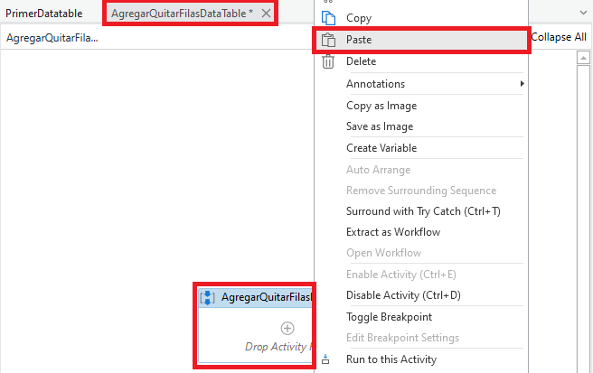

# Ejemplo 02: 

## 1. Objetivos :dart:

- Entender...

## 2. Desarrollo :hammer:

1. Crear el archivo ***`AgregarQuitarFilasDataTable`***.xaml (con el flujo de trabajo *Sequence*).

2. Crear una variable con las siguientes características:

    - Name: **`dtb_primerDatatable`**
    - Variable type: **`Datatable`**

    **Tip:** Si no te aparece el tipo de variable *DateTable*, dentro del buscador escribe *System.Data.DataTable*

3. Regresar al documento **PrimerDatatable**. Dar clic derecho a la actividad ***Build Data Table*** y seleccionar el botón ***Copy***.

 

4. Regresar al documento **AgregarQuitarFilasDataTable**. Dar clic derecho a la actividad *AgregarQuitarFilasDateTable* y seleccionar la opción ***Paste***.

 

5. Añadir la actividad ***Remove Data Row***.

 

6. Ir a las propiedades de la actividad ***Remove Data Row*** y escribir los siguientes valores:

    - Input / Datatable: **`dtb_primerDatatable`**
    - Input / RowIndex: **`1`**

 

7. Añadir la actividad ***Add Data Row***.

 

8. Ir a las propiedades de la actividad ***Add Data Row** y escribir los siguientes valores:

    - Input / ArrayRow: **`{"dato3",3}`**
    - Input / DataTable: **`dtb_primerDatatable`**

 

9. Añadir la actividad *Output Date Table*.

 

10. Ir a las propiedades de la actividad *Output Data Table* y escribir los siguientes valores:

    - Input / Datatable: **`dtb_primerDatable`**
    - Output / Text: **`str_primerDatatable`** ( **TIP:** Utilizar *Ctrl + K* )

 

11. Añadir la actividad *Write Line* y dentro de su campo de texto escribir **`str_primerDatatable`**

 

12. Ejecutar el flujo y ver los resultados.

