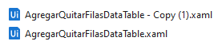
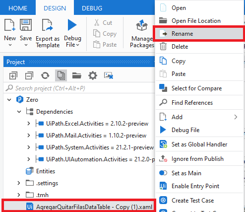
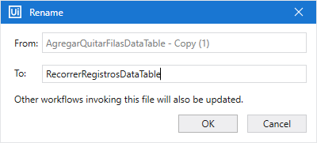
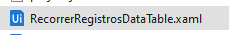
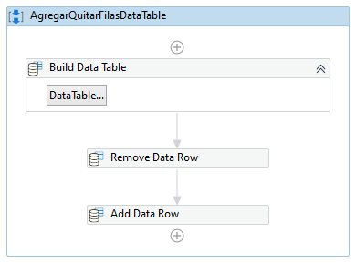
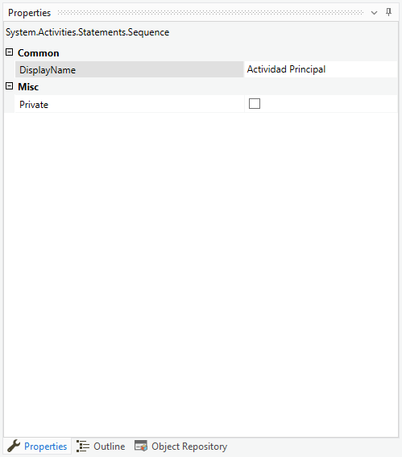
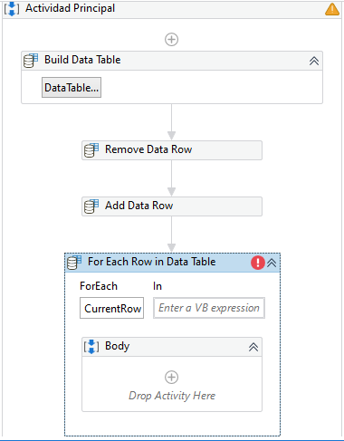
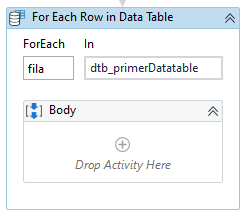
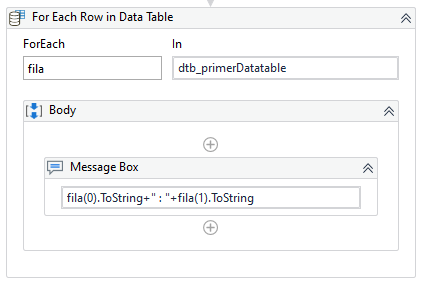

# Ejemplo 03: Recorrer los registros de un DataTable

## 1. Objetivos :dart:

- Entender...

## 2. Desarrollo :hammer:

1. Ir al panel de ***Project***, localizar el archivo que realizaste en el ejemplo 02: **AgregarQuitarFilasDataTable**.xaml y seleccionarlo. Realizar las combinaciones de teclas: ***Ctrl + C*** y ***Ctrl + V***. Aparecerá un archivo con el siguiente nombre: **AgregarQuitarFilasDataTable - Copy (1)**.

 

2. Dar clic derecho al archivo copiado y seleccionar la opción ***Rename***.

 

3. Cambiar el nombre a: **`RecorrerRegistrosDataTable`** y seleccionar la opción *OK*.

 

4. Dar doble clic al archivo **RecorrerRegistrosDataTable**.

 

5. Eliminar las actividades ***Output Data Table*** y ***Write Line***.

6. Seleccionar la actividad principal: **AgregarQuitarFilasDataTable**.

 

7. Ir al panel de ***Properties*** y en la propiedad ***DisplayName*** y escribir **`Actividad Principal`**

 

8. Añadir la actividad ***For Each Row in Data Table***.

 

9. Cambiar los valores de la actividad por los siguientes:

    - For each: **`fila`**
    - In: **`dtb_primerDatatable`**

 

10. Añadir la actividad ***Message Box*** dentro del ***Body*** del ***For Each Row in Data Table*** y escribir el mensaje: **`fila(0).ToString+" : "+fila(1).ToString`**

 

2. Ejecutar el flujo y ver los resultados.

