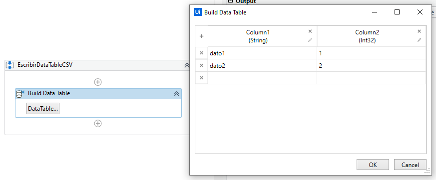

# Ejemplo 04: Ordenar los registros de una tabla de Excel

## 1. Objetivos :dart:

- Conocer la actividad ***Sort Table***.
- Aprender a crear una tabla en Excel.

## 2. Desarrollo :hammer:

1. Crear manualmente dentro de la carpeta **"C:\UiPathCourse\"** la carpeta **F**.

2. Crear el archivo ***`EscribirDataTableCSV`***.xaml (con el flujo de trabajo *Sequence*).

3. Copiar la actividad ***Build Data Table*** del ejemplo 2 o 3.

 

7. Ejecutar el flujo y ver los resultados.

