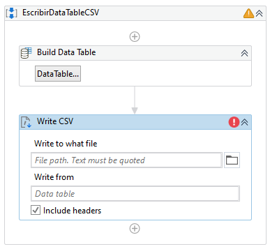
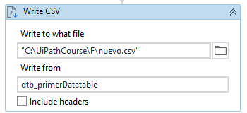

# Ejemplo 04: Escribir un Data Table en un CSV

## 1. Objetivos :dart:

## 2. Desarrollo :hammer:

1. Crear manualmente dentro de la carpeta **"C:\UiPathCourse\"** la carpeta **F**.

2. Crear el archivo ***`EscribirDataTableCSV`***.xaml (con el flujo de trabajo *Sequence*).

3. Copiar la actividad ***Build Data Table*** del ejemplo 2 o 3.

 

4. Aparecerá un **mensaje de error**. Copiar el nombre de la variable y crearla mediante **`Ctrl + K`**

5. Añadir la actividad ***Write CSV***.

 

6. Dentro de la actividad ***Write CSV***, escribir lo siguiente:

    - Write to what file: **`C:\UiPathCourse\F\nuevo.csv`**
    - Variable type: **`dtb_primerDatatable`**

    **Nota:** No marquen la casilla ***Include headers***

 

7. Ejecutar el flujo y ver los resultados.

