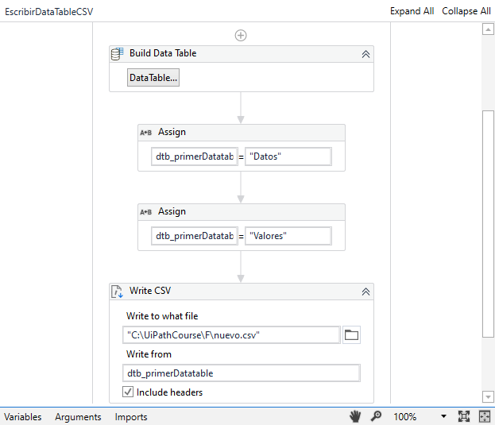

# Ejemplo 04: Personalizar los headers de un datable

## 1. Objetivos :dart:

## 2. Desarrollo :hammer:

1. Duplicar el archivo del ejemplo 4 (**EscribirDataTableCSV**.xaml).

2. Renombrarlo por **EscribirDataTableCSVHeadersPersonalizados**.xaml

3. Añadir dos actividades ***Assign*** y escribir lo siguiente:

    Primer *Assign*:
    - Del lado izquierdo: **`dtb_primerDatatable.Columns("Column1").ColumnName`**
    - Del lado derecho: **`"Datos"`**

    Segundo *Assign*:
    - Del lado izquierdo: **`dtb_primerDatatable.Columns("Column2").ColumnName`**
    - Del lado derecho: **`"Valores"`**

 

4. Ejecutar el flujo y ver los resultados.

