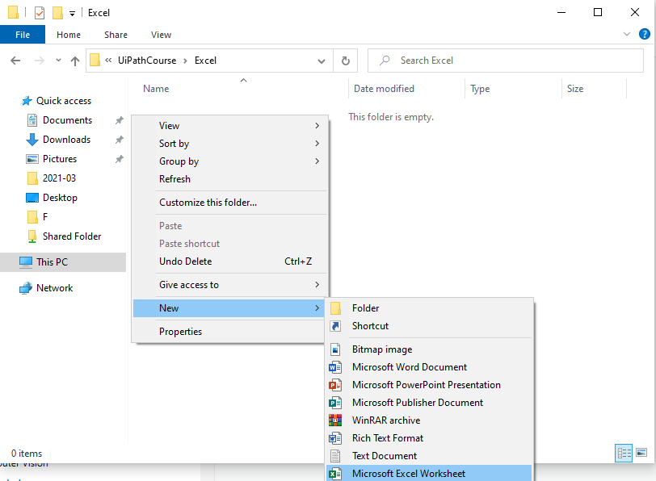
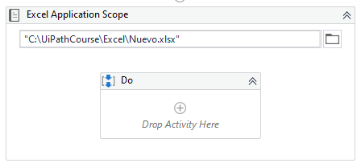
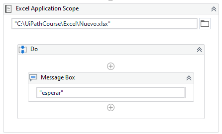
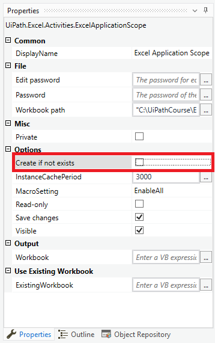
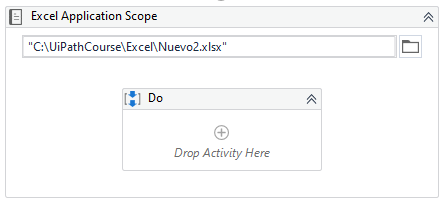

# Ejemplo 01: Utilizar un archivo excel

## 1. Objetivos :dart:

- Conocer la actividad *Excel Application Scope*.
- Comprender el uso de la propiedad *Create if not exists*. 

## 2. Desarrollo :hammer:

1. Crear manualmente la carpeta **Excel** en la carpeta **C:\UiPathCourse**.

2. Dentro de la carpeta **C:\UiPathCourse\Excel** crear manualmente un nuevo documento de Excel con el nombre: **Nuevo.xlsx**.

 

3. Crear el archivo ***UtilizarExcel.xaml*** (con el flujo de trabajo *Sequence*).

4. Añadir la actividad ***Excel Application Scope*** y escribe la ruta **`C:\UiPathCourse\Excel\Nuevo.xlsx`**

 

5. Añade la actividad ***Message Box*** dentro del ***Do*** del ***Excel Application Scope***. Escribir en el ***Message Box***: **`"esperar"`**

 

6. Ejecutar el flujo y ver los resultados.

7. Ir al panel de *Properties* de la actividad ***Excel Application Scope*** y desmarcar la opción ***Create if not exits***.

 

8. Ejecutar el flujo y ver los resultados.

9. En la actividad ***Excel Application Scope*** añadida, cambiar el nombre del archivo a utilizar: **`C:\UiPathCourse\Excel\Nuevo2.xlsx`** 

 

10. Ejecutar el flujo y ver los resultados.

