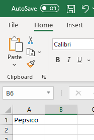
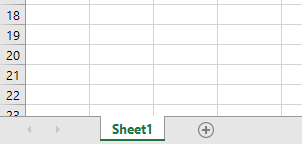
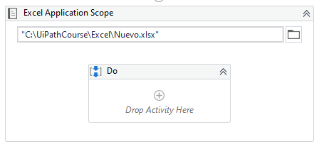
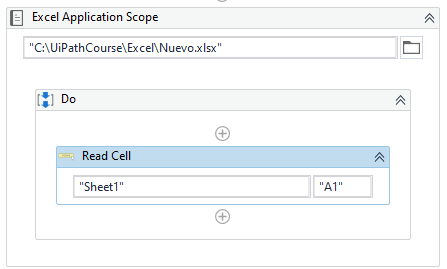
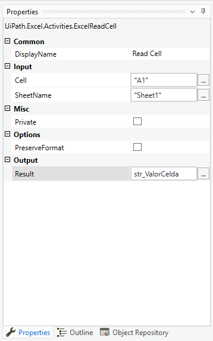
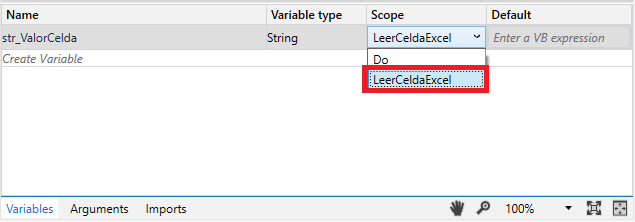
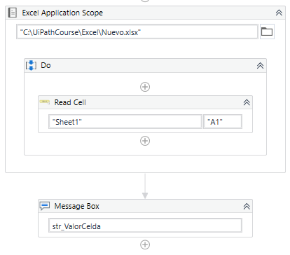

# Ejemplo 02: Leer una celda en Excel

## 1. Objetivos :dart:

- Conocer la actividad *Read Cell*.

## 2. Desarrollo :hammer:

1. Verificar que la carpeta **Excel** este creada en la carpeta **C:\UiPathCourse**. Si no existe crearla.

2. Dentro de la carpeta **C:\UiPathCourse\Excel** verificar la existencia del documento de Excel con nombre: **Nuevo.xlsx**. Si no existe crearlo con el nombre antes mencionado.

3. Abrir el archivo Excel **Nuevo.xlsx**, y escribir en la celda **A1**: **`Pepsico`**

 

4. Verificar que el nombre de la hoja sea: **`Sheet1`**. En caso de que el nombre sea otro, modificarlo con el nombre antes mencionado.

 

5. Crear el archivo ***LeerCeldaExcel***.xaml (con el flujo de trabajo *Sequence*).

6. Añadir la actividad ***Excel Application Scope*** y escribe la ruta **`"C:\UiPathCourse\Excel\Nuevo.xlsx"`**

 

7. Añadir la actividad ***Read Cell*** dentro del ***Do*** de la actividad ***Excel Applicaction Scope***.

 

8. Ir al panel ***Properties*** de la actividad ***Read Cell*** y escribir los siguientes valores:

    - *Input / Cell*: **`"A1"`**
    - *Input / SheetName*: **`"Sheet1"`**
    - *Output / Result*: **`str_ValorCelda`** (**TIP:** Crear y utilizar la variable mediante **Ctrl + K**)

 

9. Seleccionar la actividad ***Read Cell*** e ir al panel de ***Variables*** y cambiar el ***Scope*** de la variable **str_ValorCelda**, de **Do** a **LeerCeldaExcel**.
 

 

10. Añadir la actividad ***Message Box*** después de la actividad ***Excel Application Scope*** y escribir: **`str_ValorCelda`**

 

11. Ejecutar el flujo y ver los resultados.

