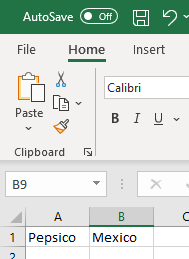
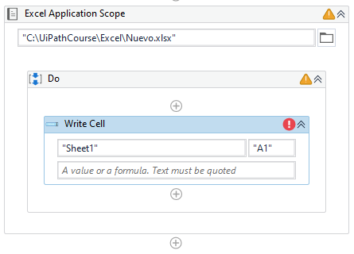
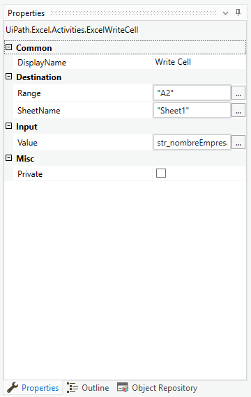
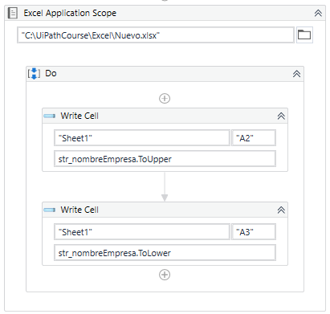

# Ejemplo 02: Escribir en un Excel

## 1. Objetivos :dart:

- Conocer la actividad *Write Cell*
- Conocer las expresiones *ToUpper* y *ToLower*

## 2. Desarrollo :hammer:

1. Verificar que la carpeta **Excel** este creada en la carpeta **C:\UiPathCourse**. Si no existe crearla.

2. Dentro de la carpeta **C:\UiPathCourse\Excel** verificar la existencia del documento de Excel con nombre: **Nuevo.xlsx**. Si no existe crearlo con el nombre antes mencionado.

3. Verificar que el nombre de la hoja sea: **`Sheet1`**. En caso de que el nombre sea otro, modificarlo con el nombre antes mencionado.

4. Verificar que el contenido del archivo Excel **Nuevo.xlsx**, sea como se muestra en la imagen:

 

5. Crear el archivo ***EscribirCeldaExcel***.xaml (con el flujo de trabajo *Sequence*).

6. Crear una variable con las siguientes características:

- *Name*: **`str_nombreEmpresa`**
- *Variable Type*: **String**
- *Default*: **`"Pepsico"`**

7. Añadir la actividad ***Excel Application Scope*** y escribe la ruta **`C:\UiPathCourse\Excel\Nuevo.xlsx`**

 

8. Añadir la actividad ***Write Cell*** dentro del ***Do*** de la actividad ***Excel Application Scope***.

 

9. Ir a las propiedades de la actividad ***Write Cell*** y escribir los siguientes valores:

- Range: **`"A2"`**
- SheetName: **`"Sheet1"`**
- Value: **`"str_nombreEmpresa.ToUpper"`**

 

10. Añadir una segunda actividad ***Write Cell*** y escribir los siguientes valores:

- Range: **`"A3"`**
- SheetName: **`"Sheet1"`**
- Value: **`"str_nombreEmpresa.ToLower"`**

 

11. Ejecutar el flujo y ver los resultados.

