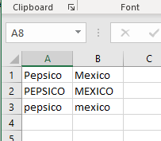
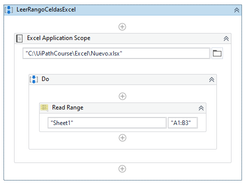
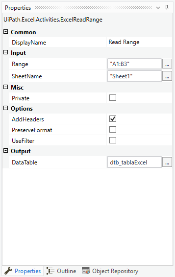
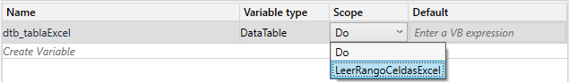
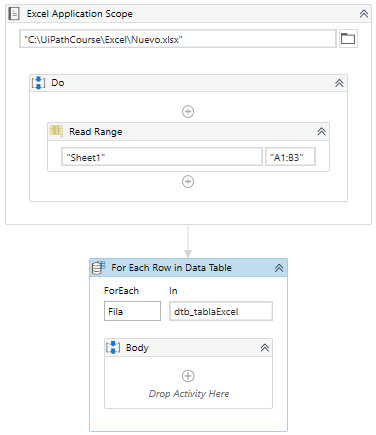
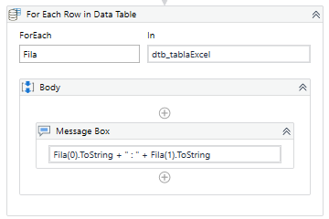

# Ejemplo 03: Leer rango de celdas en Excel

## 1. Objetivos :dart:

- 

## 2. Desarrollo :hammer:

1. Verificar que la carpeta **Excel** este creada en la carpeta **C:\UiPathCourse**. Si no existe crearla.

2. Dentro de la carpeta **C:\UiPathCourse\Excel** verificar la existencia del documento de Excel con nombre: **Nuevo.xlsx**. Si no existe crearlo con el nombre antes mencionado.

3. Verificar que el nombre de la hoja sea: **`Sheet1`**. En caso de que el nombre sea otro, modificarlo con el nombre antes mencionado.

4. Verificar que el contenido del archivo Excel **Nuevo.xlsx**, sea como se muestra en la imagen:

 

5. Crear el archivo ***LeerRangoCeldasExcel***.xaml (con el flujo de trabajo *Sequence*).
 
6. Añadir la actividad ***Excel Application Scope*** y escribe la ruta **`"C:\UiPathCourse\Excel\Nuevo.xlsx"`**

7. Añadir la actividad ***Read Range*** dentro del ***Do*** de la actividad ***Excel Application Scope***.

 

8. Ir a las propiedades de la actividad ***Read Range*** y escribir los siguientes valores:

- Input / Range: **`"A1:B3"`**
- Input / SheetName: **`"Sheet1"`**
- Output / DataTable: **`dtb_tableExcel`** (**TIP:** Crear y utilizar la variable mediante ***Ctrl + K***)

 

9. Seleccionar la actividad ***Read Range***, ir al panel de propiedades y cambiar el ***Scope*** de **Do** a **LeerRangoCeldasExcel**

 

10. Añadir la actividad **For Each Row** y escribir los siguientes valores:

    - *For each*: **`Fila`**
    - *In*: **`dtb_tablaExcel`**

 

11. Añadir la actividad ***Message Box*** dentro del ***Body*** de la actividad ***For Each Row*** y escribir lo siguiente: **`Fila(0).ToString + " : " + Fila(1).ToString`**

 

12. Ejecutar el flujo y ver los resultados.

