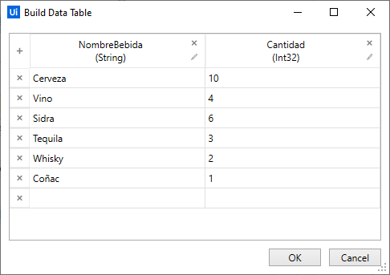
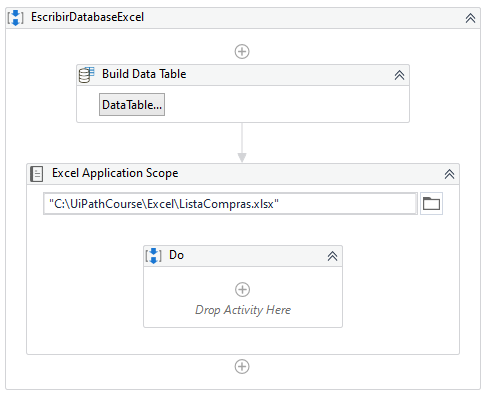
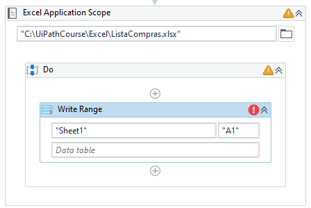
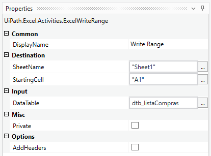
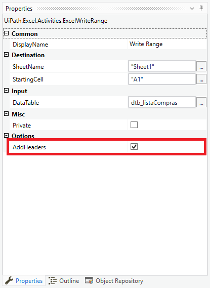

# Ejemplo 01: Escribir un DataTable en un Excel

## 1. Objetivos :dart:

- Conocer la actividad *Write Range*.
- Comprender la propiedad *AddHeaders*.

## 2. Requisitos :gear:

### Procedimiento manual

1. Verificar que la carpeta **Excel** este creada en la carpeta **C:\UiPathCourse**. Si no existe crearla.

2. Dentro de la carpeta **C:\UiPathCourse\Excel** verificar que **no exista** el documento de Excel con nombre: **ListaCompras.xlsx**. Si existe eliminar el archivo.

## 3. Desarrollo :hammer:

1. Crear el archivo ***EscribirDatabaseExcel***.xaml (con el flujo de trabajo *Sequence*).

2. Añadir la actividad ***Build Data Table*** y seleccionar la opción **"DataTable..."**.

3. Escribir la información tal como se muestra en la imagen:

    **NOTA:** Agregar cada fila y cambiar el nombre de las cabeceras.

 

4. Ir a las propiedades de la actividad ***Build Data Table*** y escribir los siguientes valores:
    - *Output / DataTable*: **`dtb_listaCompras`** (**TIP:** Crear y utilizar la variable mediante **Ctrl + K**)

5. Añadir la actividad ***Excel Application Scope*** y escribir la ruta: **`"C:\UiPathCourse\Excel\ListaCompras.xlsx"`**

 

6. Añadir la actividad ***Write Range*** dentro del ***Do*** de la actividad ***Excel Application Scope***.

 

7. Ir a las propiedades de la actividad ***Write Range*** y escribir los siguientes valores:

    - *Destination / SheetName*: **`"Sheet1"`**
    - *Destination / StartingCell*: **`"A1"`**
    - *Input / DataTable*: **`dtb_listaCompras`**

 

8. Ejecutar el flujo y ver los resultados.

9. Ir a las propiedades de la actividad ***Write Range*** y marcar la casilla de la propiedad *Options / AddHeaders*.

 

10. Ejecutar el flujo y ver los resultados.

