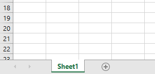
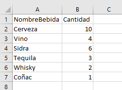
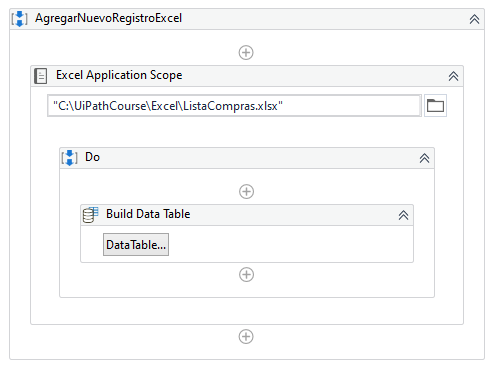
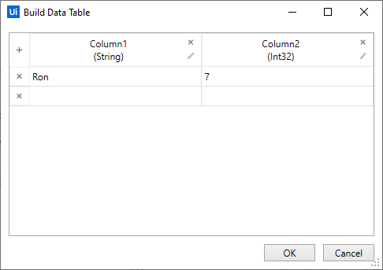
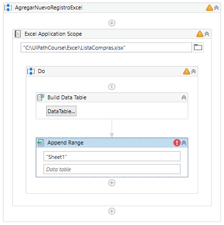
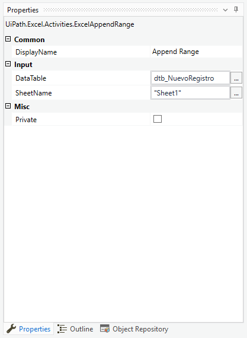

# Ejemplo 02: Leer rango y pegar en nueva hoja de Excel

## 1. Objetivos :dart:

- Repasar el funcionamiento de la actividad *Read Range* y *Write Range*.
- Conocer como leer todo el contenido de una hoja.

## 2. Requisitos :gear:

**NOTA: Realizar el procedimiento ejercicio o el procedimiento manual.**

### Procedimiento ejercicio

1. Realizar el ejemplo 01 (Escribir un DataTable en un Excel).

### Procedimiento manual

1. Verificar que la carpeta **Excel** este creada en la carpeta **C:\UiPathCourse**. Si no existe crearla.

2. Dentro de la carpeta **C:\UiPathCourse\Excel** verificar que **exista** el archivo Excel con nombre: **ListaCompras.xlsx**. Si no existe crear el archivo.

3. Verificar que el archivo Excel con nombre **ListaCompras.xlsx** tenga la pestaña con nombre **`"Sheet1"`**

 

4. Verificar que el contenido del Excel con nombre **ListaCompras.xlsx** sea como se muestra en la imagen:

 

## 3. Desarrollo :hammer:

1. Crear el archivo ***AgregarNuevoRegistroExcel***.xaml (con el flujo de trabajo *Sequence*).

2. Añadir la actividad ***Excel Application Scope*** y escribir la ruta del archivo: **`"C:\UiPathCourse\Excel\ListaCompras.xlsx"`**

3. Añadir la actividad ***Build Data Table*** dentro del ***Do*** de la actividad ***Excel Application Scope*** y dar clic en el botón ***Datatable...***

 

4. Llenar el ***DataTable*** tal y como se muestra en la siguiente imagen:

 

5. Añadir la actividad ***Append Range*** dentro del ***Do*** de la actividad ***Excel Application Scope***.

 

6. Ir a las propiedades del ***Append Range*** y escribir los siguientes valores:

    - Input / DataTable: **`dtb_NuevoRegistro`**
    - Input / SheetName: **`"Sheet1"`**

 

7. Ejecutar el flujo y ver los resultados.

