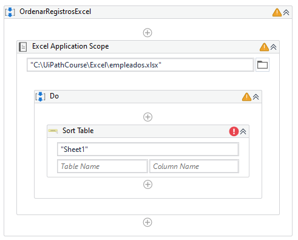
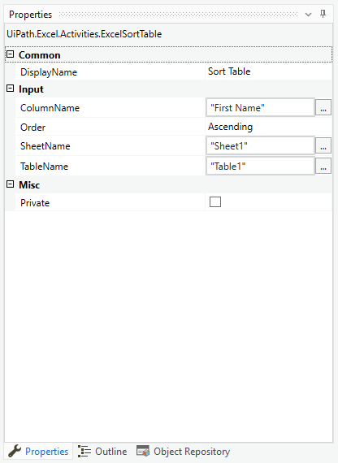

# Ejemplo 04: Ordenar los registros de una tabla Excel

## 1. Objetivos :dart:

- Repasar el funcionamiento de la actividad *Read Range* y *Write Range*.
- Conocer como leer todo el contenido de una hoja.

## 2. Requisitos :gear:

**NOTA: Realizar el procedimiento ejercicio o el procedimiento manual.**

### Procedimiento ejercicio

1. Realizar el reto 02 (Agregar Nuevo Registro Excel Empleados).

### Procedimiento manual

1. Descargar el archivo [**`empleados.xlsx`**](https://github.com/bot-jcris/RPA-UiPath-Pepsico-2021/raw/main/Session-07/material/empleados.xlsx)

2. Colocar el archivo en la ruta **`"C:\UiPathCourse\Excel"`**

## 3. Desarrollo :hammer:

1. Crear el archivo ***OrdenarRegistrosExcel***.xaml (con el flujo de trabajo *Sequence*).

2. Añadir la actividad ***Excel Application Scope*** y escribir la ruta del archivo: **`"C:\UiPathCourse\Excel\empleados.xlsx"`**

3. Añadir la actividad ***Sort Table*** dentro del ***Do*** del ***Excel Application Scope***

 

4. Ir a las propiedades del ***Sort Table*** y escribir los siguientes valores:

    - Input / DataTable: **`dtb_NuevoRegistro`**
    - Input / SheetName: **`"Sheet1"`**

 

FALTAN PASOS

7. Ejecutar el flujo y ver los resultados.

