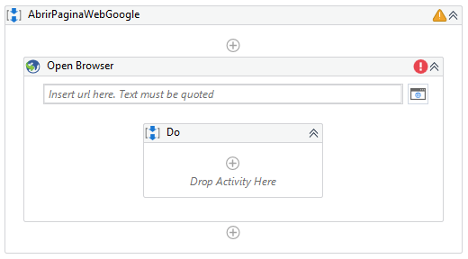
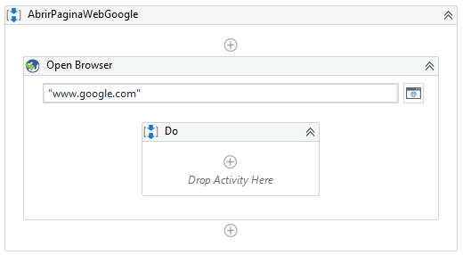

# Ejemplo 01: Abrir página web de Google

## 1. Objetivos :dart:

- Conocer la actividad *Open Browser*

## 2. Requisitos :gear:

1. Tener instalado UiPath Studio.
2. Tener instalado la extensión de Chrome y Edge.

## 3. Desarrollo :hammer:

1. Crear el archivo ***AbrirPaginasWeb***.xaml (con el flujo de trabajo *Sequence*).

2. Añadir la actividad ***Open Browser***.

 

3. Escribir la siguiente URL: **`"www.google.com"`**

 

4. Ejecutar el flujo y ver los resultados.

