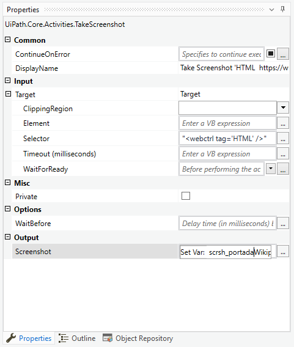

# Ejemplo 03: Tomar pantallazo de página web Wikipedia

## 1. Objetivos :dart:

- Conocer las actividades *Take Screenshot* y *Save Image*.

## 2. Requisitos :gear:

1. Tener instalado UiPath Studio.

2. Crear manualmente la carpeta **Web** dentro de la ruta **"C:\UiPathCourse"**.

## 3. Desarrollo :hammer:

1. Crear el archivo ***TomarPantallazoPaginaWeb***.xaml (con el flujo de trabajo *Sequence*).

2. Añadir la actividad ***Open Browser***.

 

3. Escribir la siguiente URL: **`"www.wikipedia.com"`**

 

4. Añadir la actividad ***Take Screenshot*** y seleccionar la opción ***Indicate element inside browser***.

 

5. Posicionar el curso encima de la página web y dar clic.

 

6. Ir a las propiedades de la actividad ***Take Screenshot*** y escribir los siguientes valores:

    - *Output / Screenshot*: **scrsh_portadaWikipedia** (**TIP:** Crear y utilizar mediante *Ctrl + K*)

 

7. Añadir la actividad ***Save Image***.

 

8. En la actividad ***Save Image*** escribir los siguientes valores:

    - *Image*: **`scrsh_portadaWikipedia`**
    - *File Path*: **`"C:\UiPathCourse\Web\PortadaWikipedia.jpg"`**

 

11. Ejecutar el flujo y ver los resultados.

