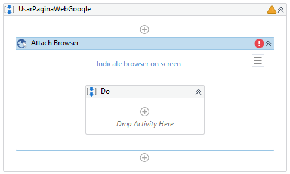
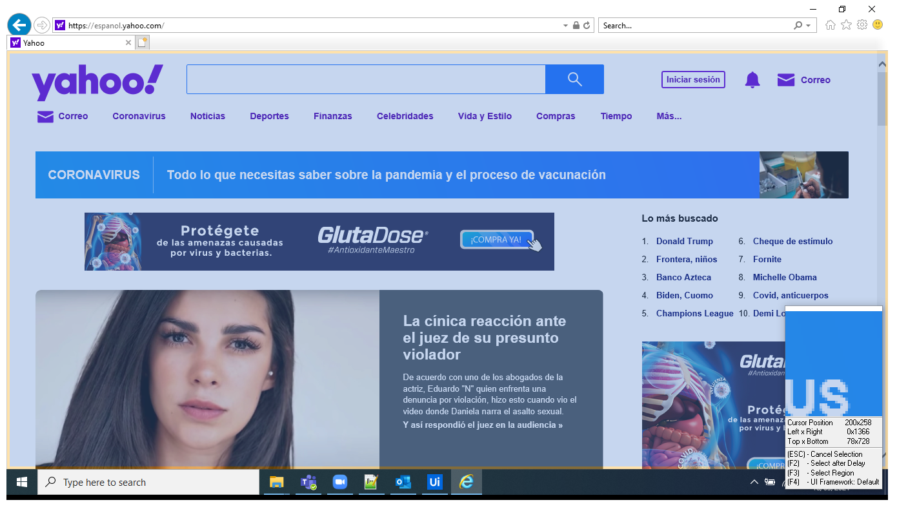
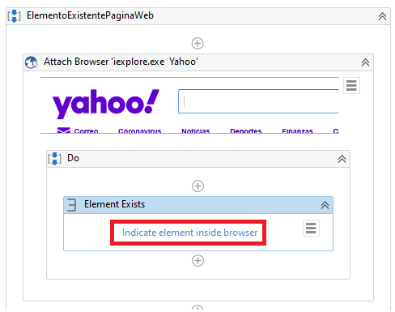
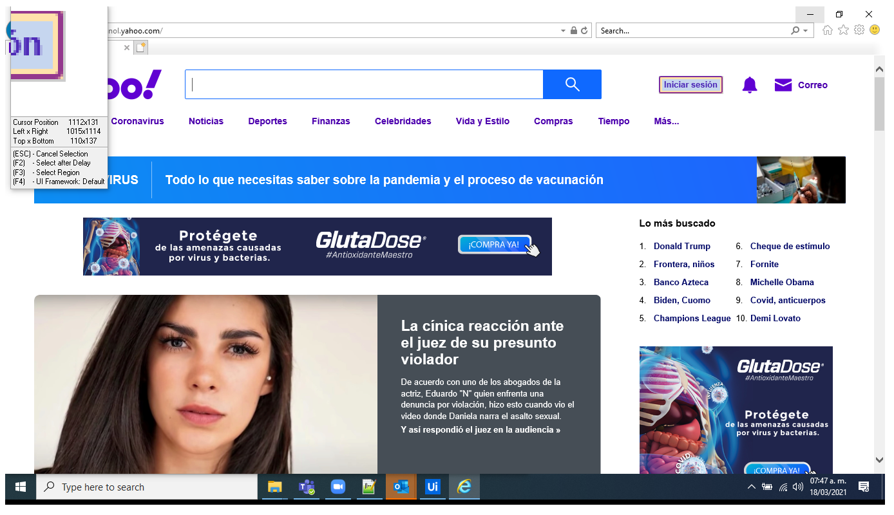
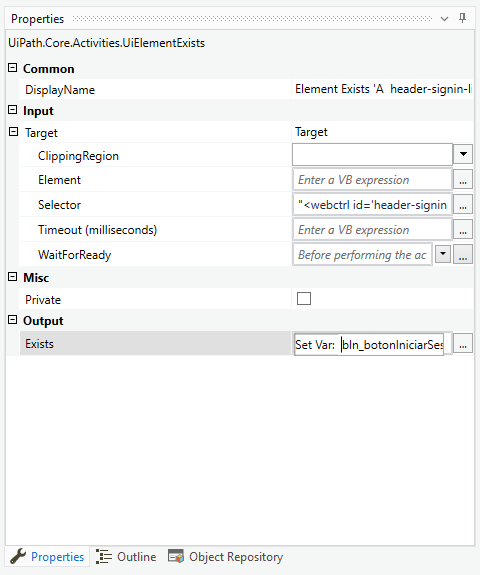
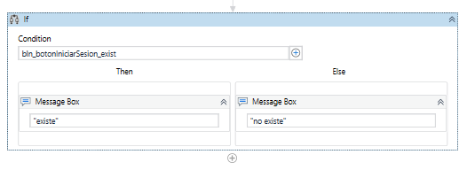

# Ejemplo 04: Elemento existente en página web

## 1. Objetivos :dart:

- Conocer la actividad *Element Exists*.

## 2. Requisitos :gear:

1. Tener instalado UiPath Studio.

## 3. Desarrollo :hammer:

1. Abrir manualmente el navegador web ***Internet Explorer*** y acceder a la página web: **`"www.yahoo.com.mx"`**

2. Verificar que no haya ninguna cuenta logueada en plataforma web Yahoo.

3. Crear el archivo ***ElementoExistentePaginaWeb***.xaml (con el flujo de trabajo *Sequence*).

3. Añadir la actividad ***Attach Browser*** y seleccionar la opción ***Indicate browser on screen***.

 

4. Posicionar el cursor encima de la página web **`www.yahoo.com.mx`** y dar clic.

 

5. Añadir la acción ***Element Exists*** y seleccionar la opción ***Indicate browser on screen***.

 

6. Posicionar el cursor encima del botón **Iniciar Sesión** de la página web **`www.yahoo.com.mx`** y dar clic.

 

7. Ir a las propiedades de la actividad ***Element Exists*** y escribir los siguientes valores:

    - Output / Exists: **bln_botonIniciarSesion** (**TIP:** Crear y utilizar la variable mediante *Ctrl + K*)

 

8. Añadir la actividad ***If*** y poner la siguiente condición: **bln_botonIniciarSesion**

    Añadir un ***Message Box*** en cada camino del ***If*** con los siguientes valores:
    - Camino ***Then***: **`existe`**
    - Camino ***False***: **`no existe`**

 

9. Ejecutar el flujo y ver los resultados.

