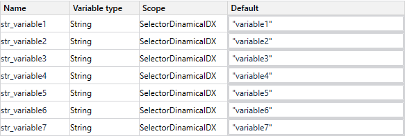
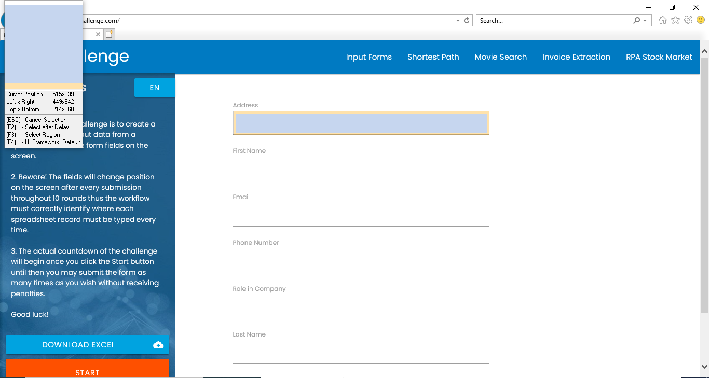
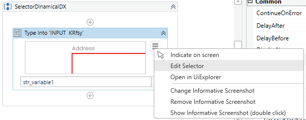
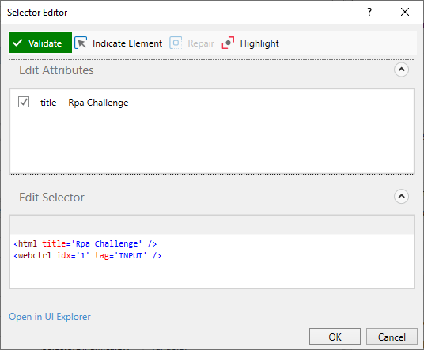
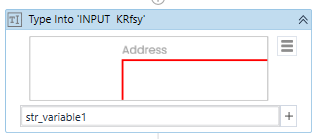
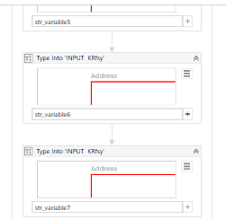

# Ejemplo 01: Selector Dinamico IDX

<div style="text-align: justify;">

## 1. Objetivos :dart:

- Conocer la ventana *Editor Selector* y sus componentes.

## 2. Requisitos :gear:

1. Tener instalado UiPath Studio.

## 3. Desarrollo :hammer:

1. Crear el archivo ***SelectorDinamicoIDX***.xaml (con el flujo de trabajo *Sequence*).

2. Crear las variables como se muestra en la imagen:

<div align="center">

</div>
<br>

3. Abrir manualmente la página web **`"www.rpachallenge.com"`**

4. Añadir la actividad ***Type Into*** y capturar el primer elemento del formulario.
    
    **NOTA:** No importa si te aparece diferente al de la imagen.

<div align="center">

</div>
<br>

5. Dar clic en el botón de la actividad ***Type Into*** para desplegar el menú de opciones y después seleccionar la opción ***Edit Selector***

<div align="center">

</div>
<br>

6. Validar que el contenido del ***Edit Selector*** te aparezca como el de la imagen.

    **NOTA:** Si el contenido es diferente reemplazarlo por:

```html
    <html title='Rpa Challenge' />
    <webctrl idx='1' tag='INPUT' />
```
<div align="center">

</div>
<br>

7. Escribir en la actividad ***Type Into*** la variable **`str_variable1`**

<div align="center">

</div>
<br>

8. Añadir las actividades ***Type Into*** faltantes para poder utilizar los 7 campos de texto del formulario.

    **NOTA:** Modifica el selector de cada ***Type Into*** de manera manual pegando el siguiente código y cambiando el valor **N** según sea el caso.

```html
    <html title='Rpa Challenge' />
    <webctrl idx='N' tag='INPUT' />
```

<div align="center">

</div>
<br>

9. Ejecutar el flujo y ver los resultados.

</div>