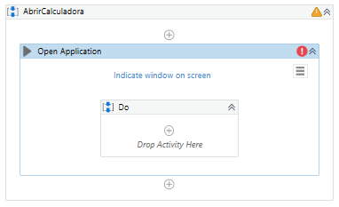
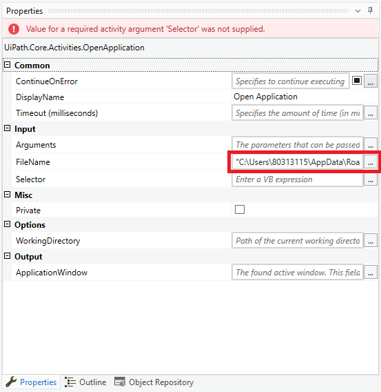
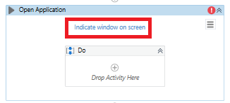
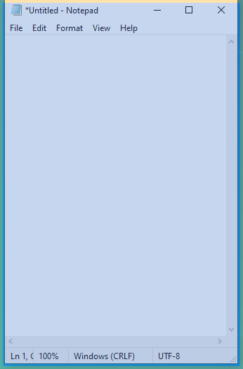
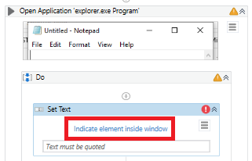
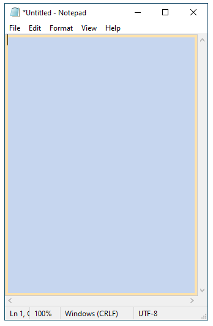
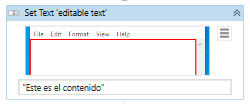
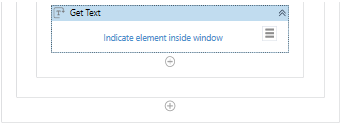
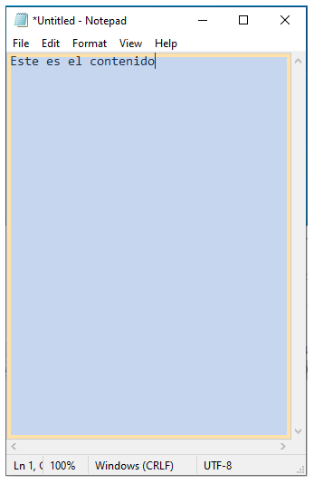
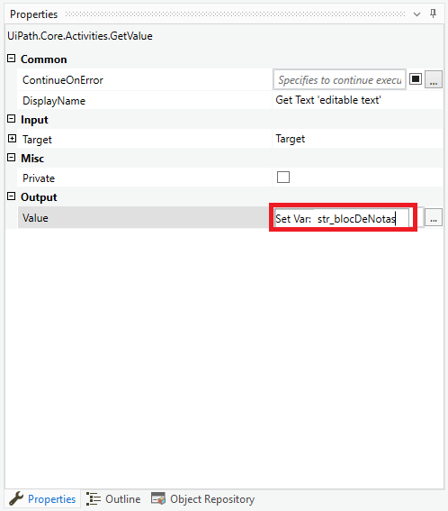

# Ejemplo 03: Manejo de la aplicación Bloc de notas

## 1. Objetivos :dart:

- Conocer el funcionamiento de las actividades *Open Application*, *Set Text* y *Get Text*.

## 2. Requisitos :gear:

1. Tener instalado UiPath Studio.

2. Tener la aplicación Calculadora.

## 3. Desarrollo :hammer:

1. Crear el archivo ***AbrirCalculadora***.xaml (con el flujo de trabajo *Sequence*).

2. Añadir la actividad ***Open Application***.

 

3. Ir a las propiedades de la actividad ***Open Application*** y en la propiedad ***Input > FileName*** escribir lo siguiente:

    **"C:\Windows\System32\notepad.exe"**

    

    
    

     

4. Abrir la aplicación ***Notepad*** o **Bloc de Notas** (dependiendo del idioma de tu máquina).

5. Seleccionar la opción ***Indicate window on screen*** de la actividad ***Open Application***.

 

6. Posicionar el cursor sobre la aplicación ***Notepad*** o **Bloc de Notas** (dependiendo del idioma de tu máquina) y dar clic.

 

7. Cerrar manualmente la aplicación ***Notepad*** o **Bloc de Notas** (dependiendo del idioma de tu máquina).

8. Ejecutar el flujo y ver los resultados.

9. Añadir la actividad ***Set Text*** y seleccionar la opción ***Indicate ele,element inside window***.

 

10. Posicionar el cursor encima del **Bloc de Notas** y dar clic.

 

11. Escribir en la actividad ***Set Text*** el siguiente mensaje: **"`Este el contenido`"**

 

12. Ejecutar el flujo y ver los resultados.

13. Añadir la actividad ***Get Text*** y seleccionar la opción ***Indicate element inside window***.

 

14. Posicionar el curso encima del área de escritura del **Bloc de Notas** y dar clic.

 

15. Ir a las propiedades de la actividad ***Get Text*** y escribir lo siguiente:

    - Output > Value: **`str_blocDeNotas`** (**TIP:** Crear y usar la variable mediante la combinación ***Ctrl + K***).

 

16. Agregar un ***Message Box*** para mostrar el contenido de la variable **`str_blocDeNotas`**

11. Ejecutar el flujo y ver los resultados.

