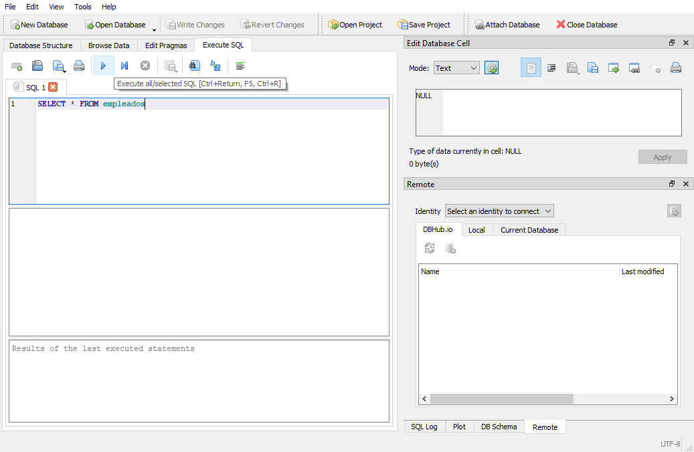

# Ejemplo 01: 

## 1. Objetivos :dart:

- Conocer el funcionamiento del *Basic Recording*.

## 2. Requisitos :gear:

1. Tener instalado UiPath Studio.

2. Tener la aplicación Calculadora.

## 3. Desarrollo :hammer:

1. Crear el archivo ***GrabadoraBasica_Calculadora***.xaml (con el flujo de trabajo *Sequence*).

2. Abrir manualmente la aplicación **Calculadora**.

 

3. En la pestaña ***Design***, seleccionar la opción *Recording* y posteriormente la opción ***Basic***.

 

4. Tener la aplicación **Calculadora** visible y seleccionar la opción ***Record***.

 

5. Posicionar el cursor sobre el número **2** de la aplicación **Calculadora** y dar clic.

 

6. Posicionar el cursor sobre el número **+** de la aplicación **Calculadora** y dar clic.

 

7. Posicionar el cursor sobre el número **2** de la aplicación **Calculadora** y dar clic.

 

8. Posicionar el cursor sobre el número **=** de la aplicación **Calculadora** y dar clic.

 

9. Teclear ***Esc*** y seleccionar la opción ***Save & Exit***.

 

10. Dentro de tu flujo principal se van a insertar las acciones grabadas.

 

11. Ejecutar el flujo y ver los resultados.

