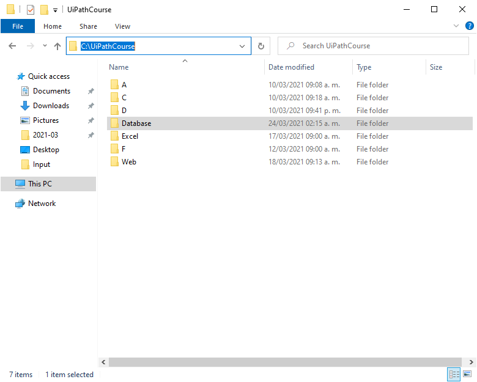
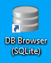
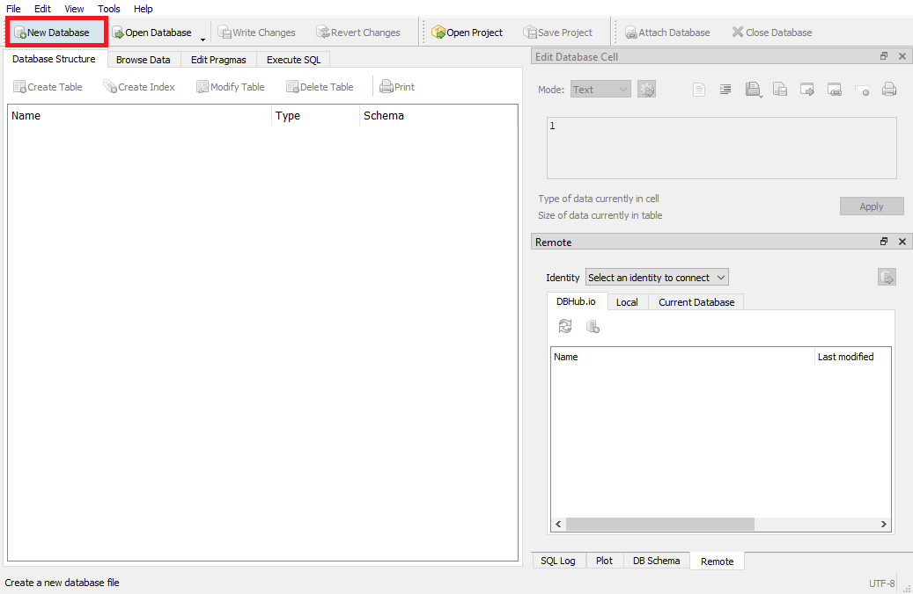
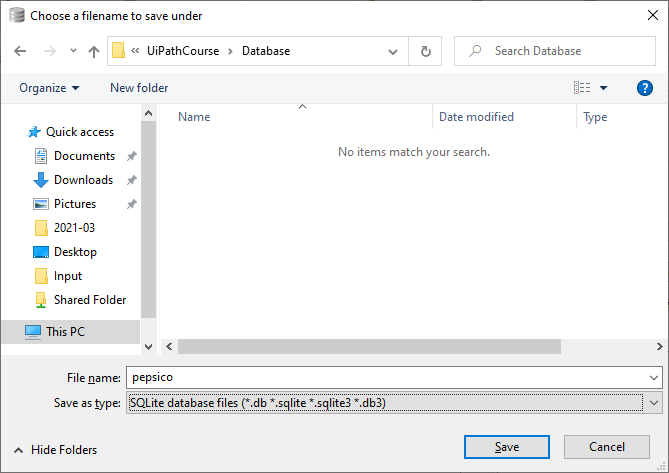
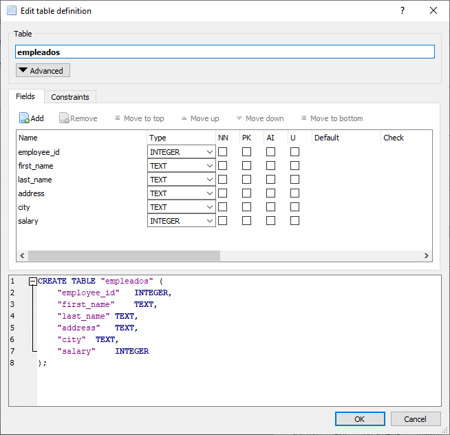
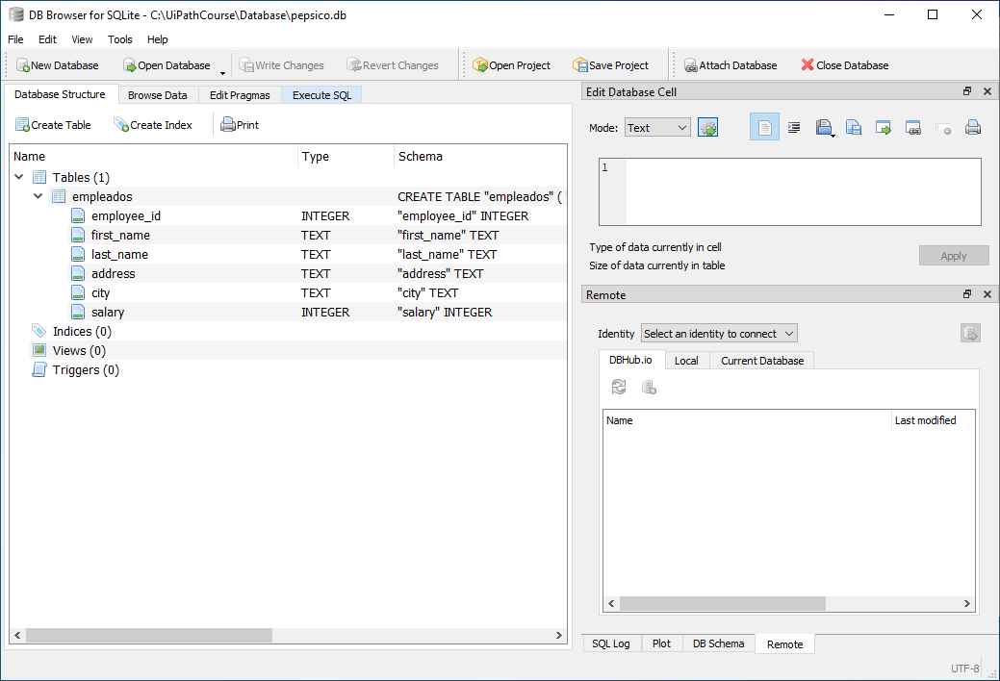

# Ejemplo 01: Crear una tabla de datos

## 1. Objetivos :dart:

- Conocer el SGBD SQLite.

## 2. Requisitos :gear:

1. Tener instalado UiPath Studio.

2. Tener DBBrowser for SQLite instalado.

## 3. Desarrollo :hammer:

1. Crear manualmente la carpeta ***`Database`*** en la ruta **C:\UiPathCourse**.

 

2. Abrir la aplicación ***DB Browser (SQLite)***.

 

3. Seleccionar la opción ***New Database***.

 

4. Almacenar dentro de la carpeta **C:\UiPathCourse\Database** el archivo de base de datos cuyo nombre será **`pepsico`**

 

5. Crear la siguiente **Tabla**:

    Nombre de la tabla: **`empleados`**

    Nombre del campo 1: **`employee_id`**

    Tipo del campo 1: **`integer`**

    Nombre del campo 2: **`first_name`**

    Tipo del campo 2: **`text`**

    Nombre del campo 3: **`last_name`**

    Tipo del campo 3: **`text`**

    Nombre del campo 4: **`address`**

    Tipo del campo 4: **`text`**

    Nombre del campo 5: **`city`**

    Tipo del campo 5: **`text`**

    Nombre del campo 6: **`salary`**

    Tipo del campo 6: **`integer`**

    Al terminar der clic en ***Ok***.

 

6. Dar clic en la pestaña ***Execute SQL***.

 

7. Escribir la siguiente sentencia y da clic en el botón de **Ejecutar**.

    **`SELECT * FROM empleados`**

 

