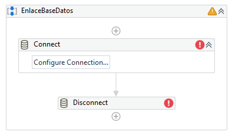
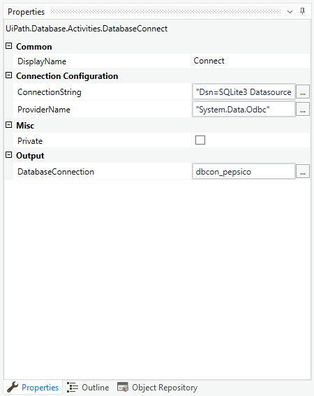
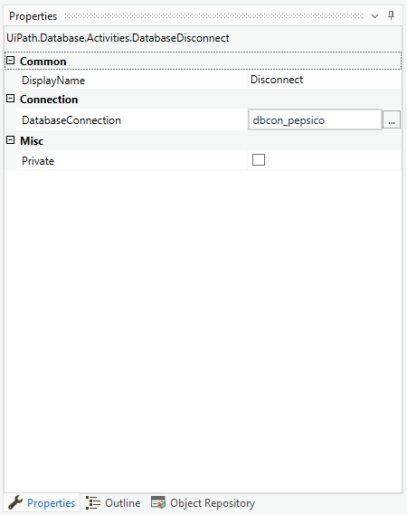

# Ejemplo 02: Enlazar a una base de datos

## 1. Objetivos :dart:

- Aprender a como conectarnos y desconectarnos de una base de datos.

## 2. Requisitos :gear:

1. Tener instalado UiPath Studio.

2. Tener el controlador ODBC de SQLite instalado.

## 3. Desarrollo :hammer:

1. Crear el archivo ***EnlaceBaseDatos***.xaml (con el flujo de trabajo *Sequence*).

 

2. Añadir las actividades ***Connect*** y ***Disconnect***.

 

3. Ir a las propiedades de la actividad ***Connect*** y escribir los siguientes valores:

    ConnectionString: ***`"Dsn=SQLite3 Datasource;Database=C:\UiPathCourse\Database\pepsico.db"`***

    ProviderName: ***`"dbcon_pepsico`***

    DatabaseConnection: ***`dbcon_pepsico`***

 

4. Ir a las propiedades de la actividad ***Disconnect*** y escribir los siguientes valores:

    DatabaseConnection: ***`dbcon_pepsico`***

 

5. Ejecutar el flujo y ver los resultados.

