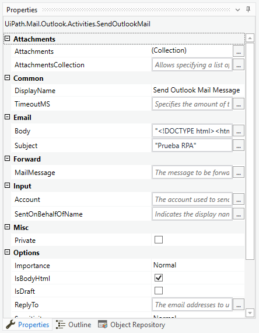

# Ejemplo 01: Enviar correo

## 1. Objetivos :dart:

- Conocer...

## 2. Requisitos :gear:

1. Tener instalado UiPath Studio.

## 3. Desarrollo :hammer:

1. Crear el archivo ***EnviarCorreo***.xaml (con el flujo de trabajo *Sequence*).

2. Añadir la actividad ***Send Outlook Mail Message***

 

3. Ir a las propiedades de la actividad ***Send Outlook Mail Message*** y modificar las siguientes variables:

    - *Email > Body:* **`Este es un contenido de prueba`**
    - *Email > Subject:* **`Prueba`**
    - *Receiver > To:* **TuCorreoInstitucional@pepsico.com**

 

4. Ejecutar el flujo y revisar tu bandeja de entrada de correo.

 

