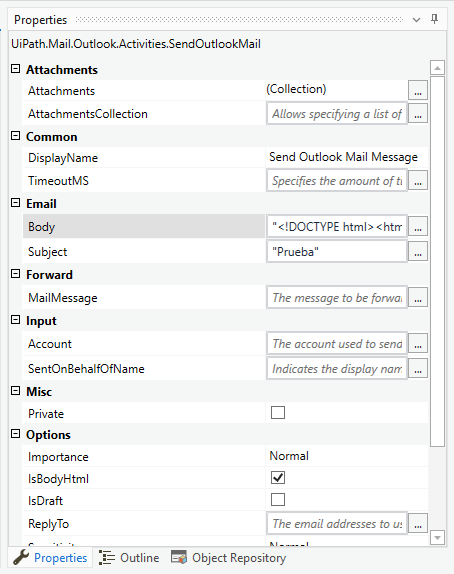

# Ejemplo 02: Enviar Correo HTML

<div style="text-align: justify;">

## 1. Objetivos :dart:

- Conocer el formato de correo HTML

## 2. Requisitos :gear:

1. Tener instalado UiPath Studio.

## 3. Desarrollo :hammer:

1. Crear el archivo ***EnviarCorreoHTML***.xaml (con el flujo de trabajo *Sequence*)

2. Crear una variable con las siguientes características:

    - *Name:* **`str_nombre`**
    - *VariableType:* **`String`**
    - *Default:* **TuNombre**

3. Añadir la actividad ***Send Outlook Mail Message***

<div align="center">

</div>
<br>

4. Ir a las propiedades de la actividad ***Send Outlook Mail Message*** y modificar las siguientes variables:

    - *Email > Body:* 

    ```HTML
    "<!DOCTYPE html><html><head/><body><div><font size='4' face='Arial Narrow' color='black'>Hola, </font><font size='4' face='Arial Narrow' color='#65349d'></font><p><font size='4' face='Arial Narrow' color='black'>Para informarte que el proceso fue realizado satisfactoriamente</font></p></div><br><div><p><font size='4' face='Arial Narrow' color='black'>Saludos,</font></p></div><div><table width='60%' align='left'><tr><td width='55%'><table width='100%' cellpadding='2'><tr><td><b><font size='4' face='Arial Narrow' color='#65349d'>"+str_nombre.ToUpper+"</font></b></td></tr><tr><td><font size='4' face='Arial Narrow' color='black'>Experto en RPA</font></td></tr><tr><td><font size='4' face='Arial Narrow' color='black'>https://www.pepsico.com.mx/</font></td></tr></table></td></tr></table></div></body></html>"
    ```

    - *Email > Subject:* **`Prueba`**
    - *Receiver > To:* **TuCorreoInstitucional@pepsico.com**

<div align="center">

</div>
<br>

5. Ejecutar el flujo y revisar tu bandeja de entrada de correo.

</div>