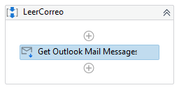
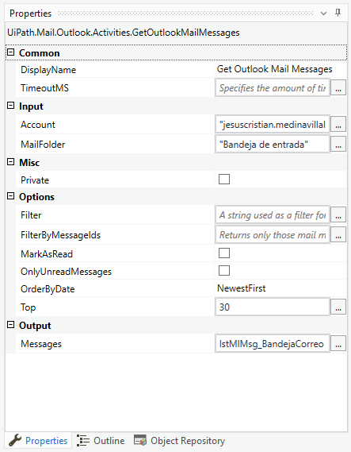
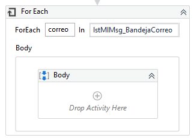
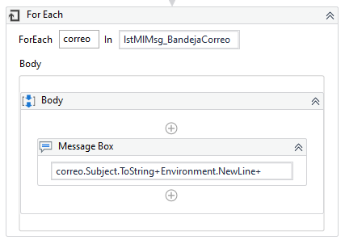
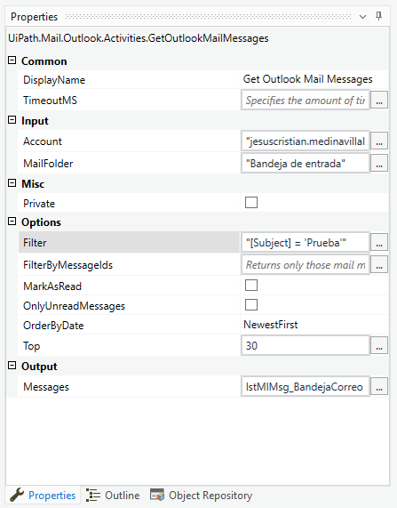

# Ejemplo 03: LeerCorreo

<div style="text-align: justify;">

## 1. Objetivos :dart:

- Conocer el procedimiento para leer tu bandeja de correo.
- Conocer la actividad *Get Outlook Mail Message*.

## 2. Requisitos :gear:

1. Tener instalado UiPath Studio.

## 3. Desarrollo :hammer:

1. Crear el archivo ***LeerCorreo***.xaml (con el flujo de trabajo *Sequence*)

2. Añadir la actividad ***Get Outlook Mail Message***

<div align="center">

</div>
<br>

3. Ir a las propiedades de la actividad ***Get Outlook Mail Message*** y modificar los siguientes valores:

    - *Input > Account:* **Correo de la Cuenta de Correo a leer**, p.e. correo@pepsico.com (**opcional**)
    - *OnlyUnreadMessages:* **Desmarcar casilla**
    - *Output > Messages:* **`lstMlMsg_BandejaCorreo`** (**TIP:** Utilizar la combinación *CTRL + K* para crear y usar la variable)

<div align="center">

</div>
<br>

4. Añadir la actividad ***For Each*** con los siguientes valores:

    - *For Each:* **correo**
    - *In:* **`lstMlMsg_BandejaCorreo`**

<div align="center">

</div>
<br>

5. Añadir la actividad ***Message Box*** con el siguiente mensaje:

    ```
    correo.Subject.ToString+Environment.NewLine+
    correo.To.ToString+Constants.vbCrLf+
    correo.Date
    ```

<div align="center">

</div>
<br>

6. Ejecutar el flujo y revisar los resultados.

7. Ir a las propiedades de la actividad ***Get Outlook Mail Message*** y modificar los siguientes valores:

 - *Options > Filter:* **`"[Subject] = 'Prueba RPA'"`**

<div align="center">

</div>
<br>

8. Ejecutar el flujo y revisar los resultados.

</div>


