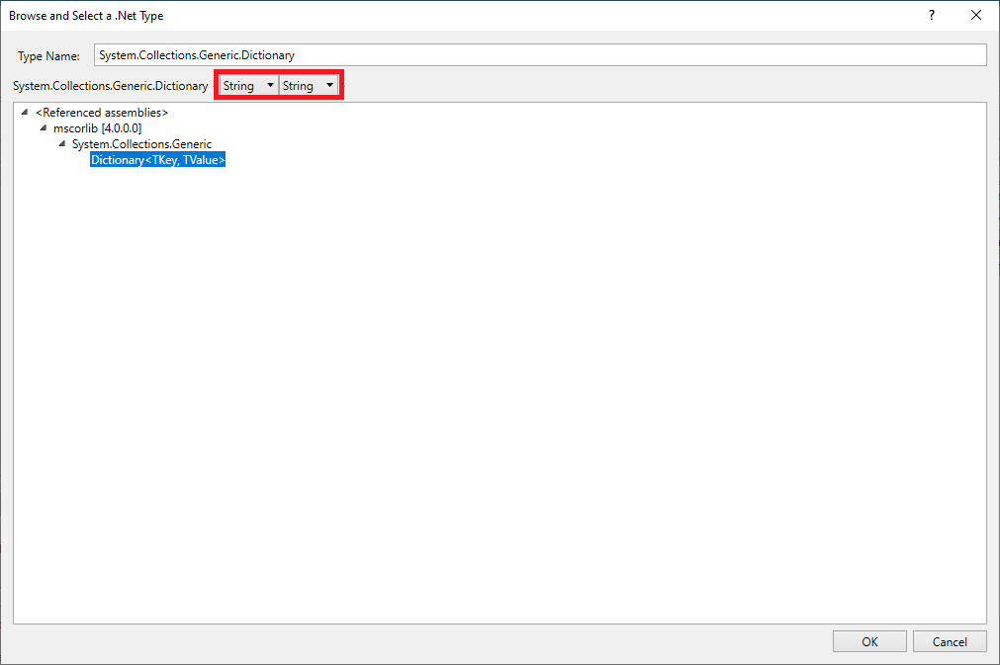
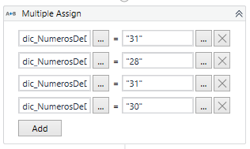
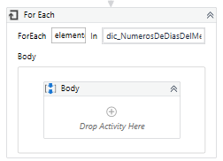
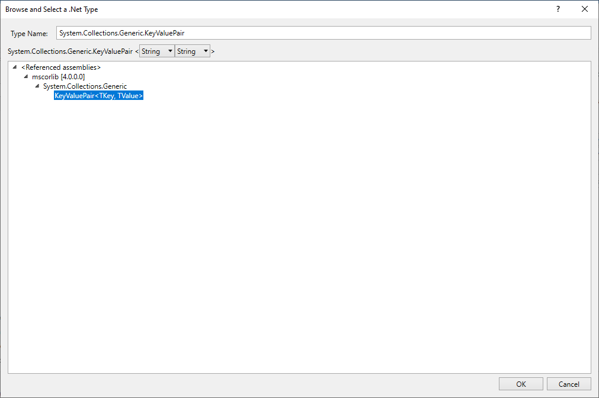
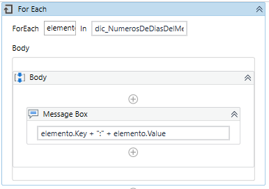
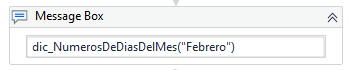
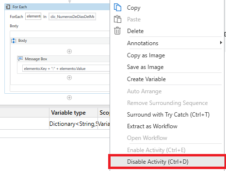

# Ejemplo 01: Crear un diccionario

## 1. Objetivos :dart:

- Conocer la varible *Dictionary*.

## 2. Requisitos :gear:

1. Tener instalado UiPath Studio.

2. Descargar el siguiente archivo y colocar dentro de la carpeta del proyecto:

- [**`Config.xlsx`**](https://github.com/bot-jcris/RPA-UiPath-Pepsico-2021/raw/main/Session-13/material/Config.xlsx)

## 3. Desarrollo :hammer:

1. Crear el archivo ***VariableDiccionario***.xaml (con el flujo de trabajo *Sequence*).

2. Crear una variable con los siguientes valores:

    - Name: **`dic_NumerosDeDiasDelMes`**
    - VariableType: **Dictionary<String,String>**
    - Default: **`New Dictionary(Of String,String)`**

    **NOTA:** Para definir la variable ***Dictionary<String,String>*** te recomiendo ir al navegador de tipos (***Browse for Types...***) y buscar la variable **`System.Collections.Generic.Dictionary`**. Escoger en las listas desplegables los tipos de variables ***String*** y ***String*** tal como se muestra en la imagen:

 

3. Añadir la actividad ***Multiple Assign*** y añadir la siguiente relación de valores:

    - **`dic_NumerosDeDiasDelMes("Enero")`** = **`"31"`**
    - **`dic_NumerosDeDiasDelMes("Febrero")`** = **`"28"`**
    - **`dic_NumerosDeDiasDelMes("Marzo")`** = **`"31"`**
    - **`dic_NumerosDeDiasDelMes("Abril")`** = **`"30"`**

 

4. Añadir la actividad ***For each*** y escribir los siguientes valores:

    - *For Each:* **`elemento`**
    - *in:* **`dic_NumerosDeDiasDelMes`**

 

5. Ir a las propiedades de la actividad ***For each*** y verificar que el ***TypeArgument*** sea ***System.Collections.Generic.KeyValuePair<String,String>***.

    **NOTA:** Ir a la opción ***Browse for Types...***, buscar el tipo **`System.Collections.Generic.KeyValuePair`** y seleccionar en las listas desplegables ***String*** y ***String*** tal y como se muestra en la imagen:

 

6. Añadir la actividad ***Message Box*** adentro del ***Body*** de la actividad ***For Each***. Dentro de la actividad ***Message Box*** escribir: **`elemento.Key + ":" + elemento.Value`**

 

7. Ejecutar el flujo y ver los resultados.

8. Agregar la actividad ***Message Box*** y escribir: **`dic_NumerosDeDiasDelMes("Febrero")`**

 

9. Dar clic derecho a la actividad ***For Each*** y seleccionar la opción ***Disable Activity***.

 

10. Ejecutar el flujo y ver los resultados.

