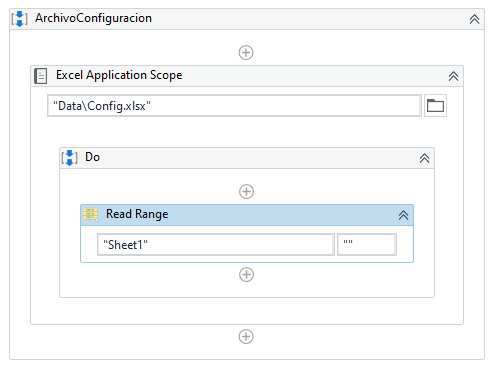
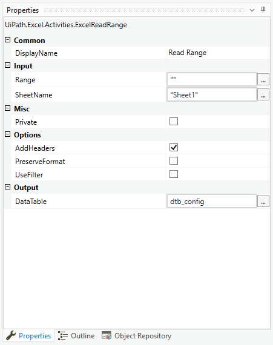

# Ejemplo 02: Crear el diccionario de configuración

## 1. Objetivos :dart:

-  Conocer la practicidad del uso de un archivo de configuración.

## 2. Requisitos :gear:

1. Tener instalado UiPath Studio.

2. Descargar el siguiente archivo y colocar dentro de la carpeta ***Data*** que crearás dentro de la carpeta del proyecto:

- [**`Config.xlsx`**](https://github.com/bot-jcris/RPA-UiPath-Pepsico-2021/raw/main/Session-13/material/Config.xlsx)

3. Verificar tener un archivo Excel **Nuevo.xlsx** dentro de la ruta **C:\UiPathCourse\Excel** y que tenga una hoja con el nombre ***Sheet1***. En caso de no ser así realizar los pasos necesarios.

## 3. Desarrollo :hammer:

1. Crear el archivo ***ArchivoConfiguracion***.xaml (con el flujo de trabajo *Sequence*).

2. Añadir la actividad ***Excel Application Scope*** y escribir **`"Data\Config.xlsx"`**

3. Añadir la actividad ***Read Range***.

 

4. Ir a las propiedades de la actividad ***Read Range*** y escribir los siguientes valores:

    - *Input > Range*: **`""`**
    - *Input > SheetName*: **`"Sheet1"`**
    - *Options > AddHeaders*: **Habilitar**
    - *Output > DataTable*: **`"dtb_config"`**

 

5. Ir a las propiedades de la actividad ***Read Range*** y escribir los siguientes valores:

    - *For Each*: **`registro`**
    - *In*: **`dtb_config`**

    **NOTA:** Si no te reconoce la variable **dtb_config**, cambia el ***Scope*** de la variable seleccionando la actividad ***Read Range***.

 

6. Crear la variable ***Dictionary*** con los siguientes valores:
    - *Name*: **`dic_config`**
    - VariableType: **Dictionary<String,Object>**
    - Default: **`New Dictionary(Of String,Object)`**

    **NOTA:** Para definir la variable ***Dictionary<String,Object>*** te recomiendo ir al navegador de tipos (***Browse for Types...***) y buscar la variable **`System.Collections.Generic.Dictionary`**. Escoger en las listas desplegables los tipos de variables ***String*** y ***Object*** tal como se muestra en la imagen:

 

10. Ejecutar el flujo y ver los resultados.

