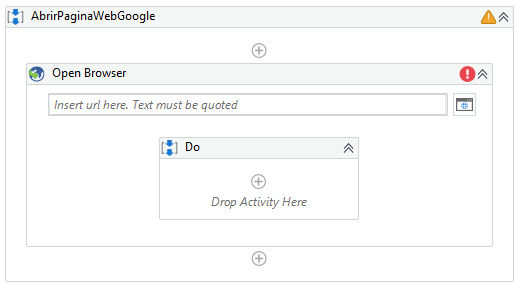

# Ejemplo 01: Buscar en la página web Google

## 1. Objetivos :dart:

- Conocer el procedimiento de depuración.
- Conocer las acciones de depuración: *Slow Step*, *Execution Trail* y *Highlight Elements*.

## 2. Requisitos :gear:

1. Tener instalado UiPath Studio.

2. Haber realizado el ejemplo 02 de la sesión 8 (BuscarPaginaWebGoogle.xaml) ó realizar los pasos del 1 al 11.

## 3. Desarrollo :hammer:

1. Crear el archivo ***BuscarPaginaWebGoogle***.xaml (con el flujo de trabajo *Sequence*).

2. Añadir la actividad ***Open Browser***.

 

3. Escribir la siguiente URL: **`"www.google.com"`**

 

4. Añadir la actividad ***Type Into*** y dar clic en la opción ***Indicate element inside Browser***.

 

5. Posicionar el cursor encima de la caja de texto del buscador de la página web y dar clic.

 

6. Escribir en la actividad ***Type Into***: **`"Google Gravity"`**

 

7. Añadir la actividad ***Click*** y dar clic en la opción ***Indicate element inside Browser***.

 

8. Posicionar el cursor encima del botón **Buscar con Google** y dar clic.

 

9. Añadir la actividad ***Click*** y dar clic en la opción ***Indicate element inside Browser***.

 

10. Posicionar el cursor encima de la primera opción que aparece de la búsqueda y dar clic.

 

11. Ejecutar el flujo y ver los resultados.

12. En la pestaña ***Debug*** seleccionar las acciones ***Slow Sleep***, ***Execution Trail*** y ***Highlight Elements***

 

13. Ejecutar el flujo y ver los resultados.

