# Ejemplo 01: Automatizando Facebook

## 1. Objetivos :dart:

- Conocer el Try Catch

## 2. Requisitos :gear:

1. Tener instalado UiPath Studio.

## 3. Desarrollo :hammer:

1. Crear el archivo ***FacebookLogin***.xaml (con el flujo de trabajo *Sequence*).

2. Añadir la actividad ***Open Browser*** y escribir: **`"www.facebook.com"`**

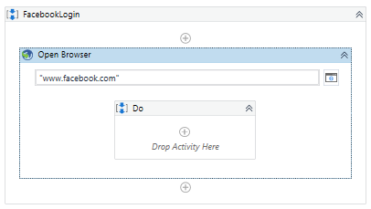

 

3. Ir a las propiedades de la actividad ***Open Browser*** y escribir lo siguiente: 

    - *Input > BrowserType*: **BrowserType.Chrome**

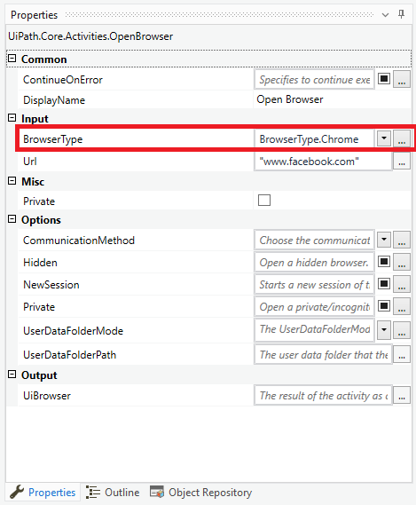

 

4. Cerrar los navegadores web **Chrome**

5. Modificar el contenido de la actividad ***Open Browser*** y escribir: **`www.facebook.com`**

7. Ejecutar el flujo mediante el tipo de ejecución ***Debug File*** y ver los resultados.

8. Modificar el contenido de la actividad ***Open Browser*** y escribir: **`www.google.com`**. Seleccionar el botón que se indica en la siguiente imagen:

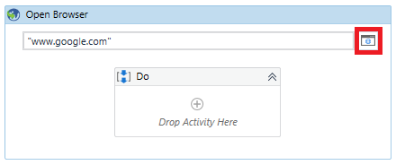

 

9. Añadir la actividad ***Click*** y seleccionar la opción ***Indicate element inside browser***.

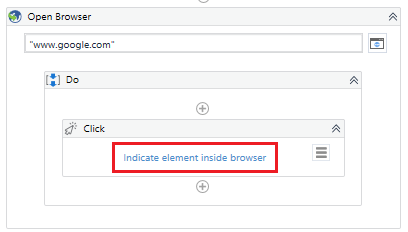

 

10. Posicionar el cursor sobre el botón **Me siento con suerte** y dar clic.

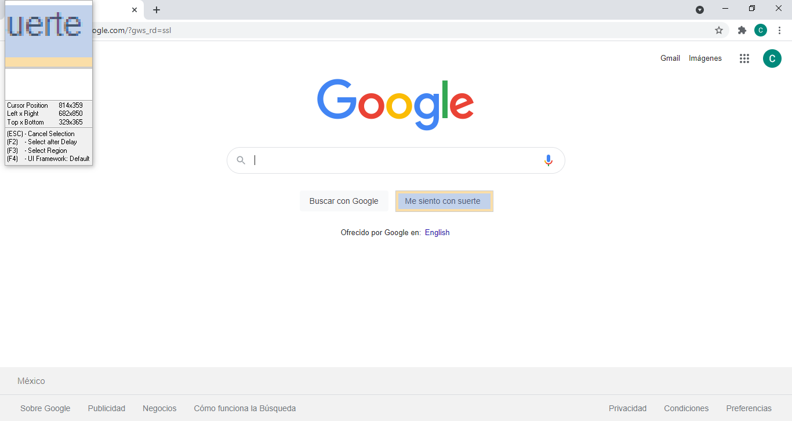

 

11. Cerrar los navegadores web **Chrome**

12. Ejecutar el flujo mediante el tipo de ejecución ***Debug File*** y ver los resultados.

13. Cerrar los navegadores web **Chrome**

14. Modificar el contenido de la actividad ***Open Browser*** y escribir: **`www.facebook.com`**

 

15. Ir a las propiedades de la actividad ***Click*** y escribir lo siguiente:

    - *Input > Target > Timeout (miliseconds):* **`5000`**

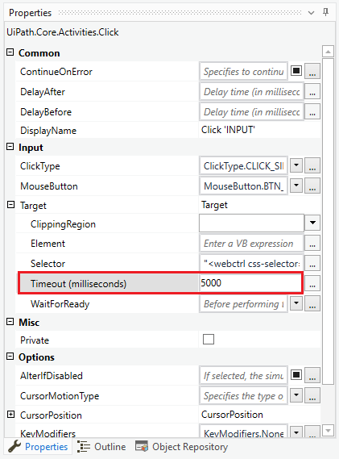

 

16. Añadir la actividad ***Message Box*** y escribir: **`"CONTINUA"`**

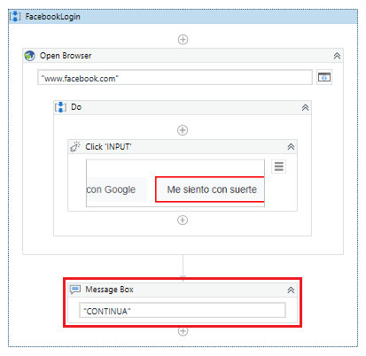

 

17. Ejecutar el flujo mediante el tipo de ejecución ***Debug File*** y ver los resultados.

18. Cerrar los navegadores web **Chrome**

19. Da clic en el botón ***Continue*** hasta que la ejecución sea completada.

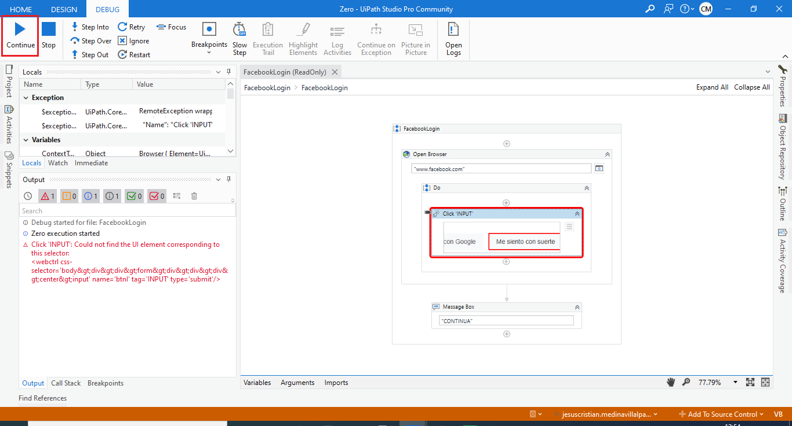

 

20. Ejecutar el flujo mediante el tipo de ejecución ***Run File*** y ver los resultados.

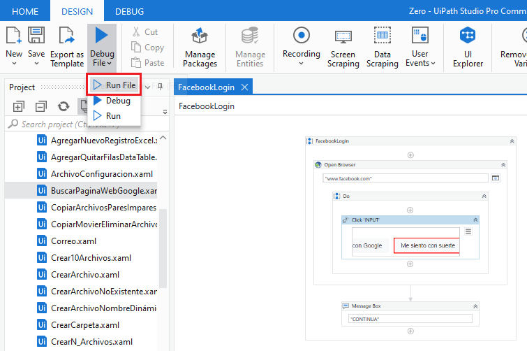

 

21. Ir a las propiedades de la actividad ***Click*** y en la opción ***ContinueOnError*** habilitar la opción ***True***.

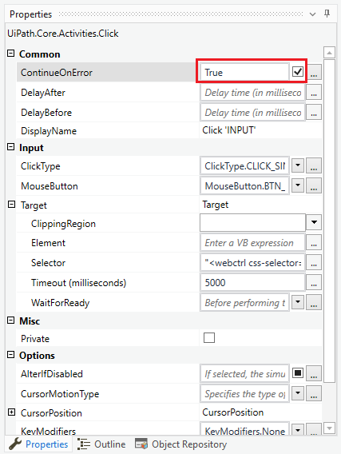

 

22. Ejecutar el flujo mediante el tipo de ejecución ***Debug File*** y ver los resultados.

23. Cerrar los navegadores web **Chrome**

24. Ir a las propiedades de la actividad ***Click*** y deshabilitar la propiedad ***ContinueOnError***.

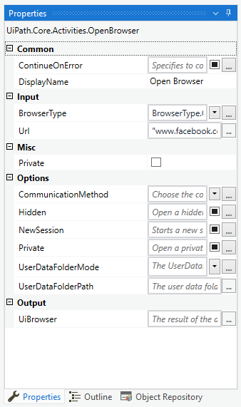

 

25. Añadir la actividad ***Try Catch*** y arrastrar a la sección ***Try*** la actividad previamente agregada ***Open Browser***, tal como se muestra en la imagen.

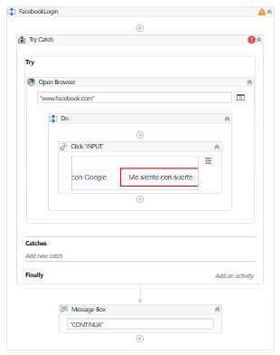

 

26. De la actividad ***Try Catch*** seleccionar la opción ***Add new catch***.

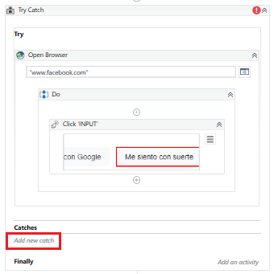

 

27. Seleccionar la opción ***System.Excepcion***.

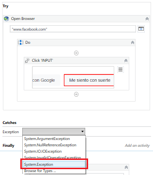

 

28. Ejecutar el flujo mediante el tipo de ejecución ***Run File*** y ver los resultados.

29. Cerrar los navegadores web **Chrome**

30. Añadir la actividad ***Message Box*** y escribir: **`"System Exception: "+exception.Message`**

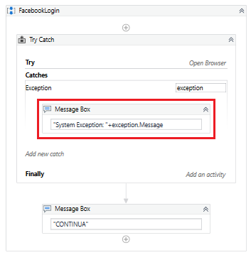

 

31. Ejecutar el flujo mediante el tipo de ejecución ***Run File*** y ver los resultados.

32. Cerrar los navegadores web **Chrome**

33. Añadir la actividad ***Throw*** como se muestra en la imagen.

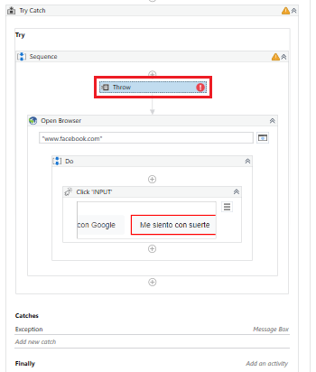

 

34. Ir a las propiedades de la actividad ***Throw*** y modificar lo siguiente:

    - *Exception:* **`New BusinessRuleException("Regla de negocio incumplida")`**

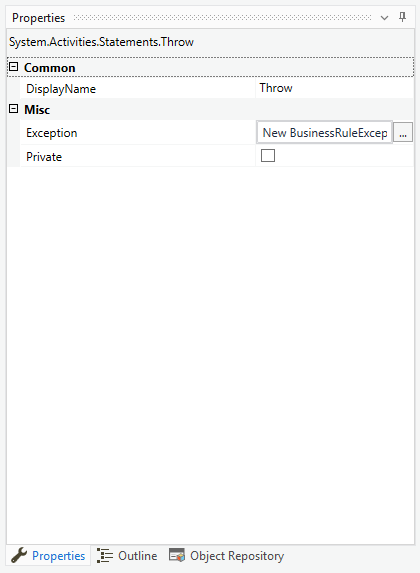

 

35. Ejecutar el flujo mediante el tipo de ejecución ***Run File*** y ver los resultados.

36. Cerrar los navegadores web **Chrome**

37. En la actividad ***Try Catch*** seleccionar nuevamente la opción ***Add new catch***

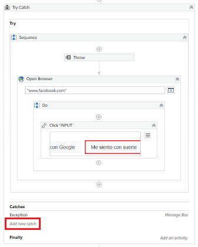

 

38. Seleccionar la opción ***Browse for Types...***

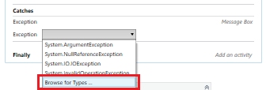

 

39. Escribir en el buscador ***`BusinessRuleException`***, seleccionar la opción correspondiente y dar clic en ***OK***.

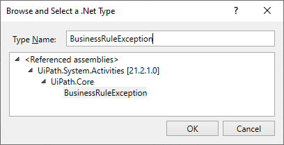

 

